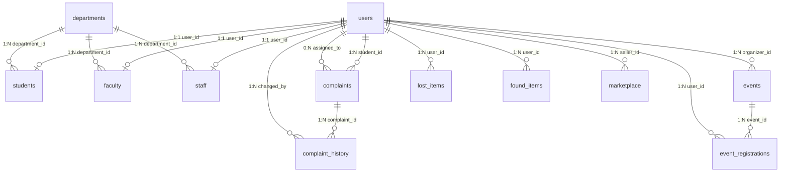

# Smart Campus Portal — Database Structure & Architecture Notes

**Database Engine:** MySQL 8.0+ / MariaDB 10.4+  
**Storage Engine:** `InnoDB` (ACID compliant, Row-level locking, Foreign Keys)  
**Encoding & Collation:** `utf8mb4` / `utf8mb4_unicode_ci` (Full Unicode, Multilingual, Emoji support)  
**Normalization Level:** Third Normal Form (3NF)  
**Node.js Driver:** `mysql2/promise` with Connection Pooling  

---

## 1. High-Level Database Philosophy

The **Smart Campus Portal** database is designed around four core architectural principles:

1. **Centralized Identity with Role Specialization (Table Inheritance):**  
   Authentication and common identity fields (`full_name`, `email`, `password_hash`, `role`, `avatar_url`) are concentrated in a single `users` table. Specialized domain attributes are factored out into 1-to-1 extension tables (`students`, `faculty`, `staff`). This avoids sparse, NULL-bloated tables while keeping login queries fast.
2. **Strict Referential Integrity (Foreign Key Constraints):**  
   Every relationship is enforced at the database engine level using explicit constraints (`ON DELETE CASCADE`, `ON DELETE SET NULL`, `ON DELETE RESTRICT`) to prevent orphaned rows.
3. **Auditability by Design (Immutable Append-Only Ledgers):**  
   Critical workflows like campus maintenance complaints maintain a dedicated `complaint_history` ledger tracking every status change, timestamp, author, and note.
4. **Defense-in-Depth against SQL Injection:**  
   Every query executed from Node.js uses binary parameterized prepared statements (`pool.execute(sql, params)`), guaranteeing that user input is never concatenated directly into SQL queries.

---

## 2. Table-by-Table Architecture Breakdown

The schema comprises **14 normalized tables** grouped into 5 functional subsystems:

```
┌────────────────────────────────────────────────────────────────────────┐
│                        14 NORMALIZED TABLES MATRIX                     │
├──────────────────────────┬─────────────────────────────────────────────┤
│ 1. Identity & Structure  │ departments, users, students, faculty, staff│
├──────────────────────────┼─────────────────────────────────────────────┤
│ 2. Grievance Management  │ complaints, complaint_history               │
├──────────────────────────┼─────────────────────────────────────────────┤
│ 3. Campus Events         │ events, event_registrations                 │
├──────────────────────────┼─────────────────────────────────────────────┤
│ 4. Lost & Found System   │ lost_items, found_items                     │
├──────────────────────────┼─────────────────────────────────────────────┤
│ 5. P2P Marketplace       │ marketplace                                 │
├──────────────────────────┼─────────────────────────────────────────────┤
│ 6. Directory & GIS       │ emergency_contacts, campus_locations        │
└──────────────────────────┴─────────────────────────────────────────────┘
```

---

### Subsystem 1: Identity & Institutional Structure

#### 1. `departments`
- **Purpose:** Stores collegiate academic departments and administrative units.
- **Key Columns:**
  - `department_id` (INT, PK, AUTO_INCREMENT)
  - `department_code` (VARCHAR(20), UNIQUE) — e.g. `'CSE'`, `'ECE'`, `'MECH'`.
  - `department_name` (VARCHAR(150)) — e.g. `'Computer Science & Engineering'`.
  - `hod_name` (VARCHAR(150)) — Head of Department.
  - `contact_email`, `contact_phone`, `building_location`
- **Design Note:** Acts as the parent organizational entity for faculty, staff, and students.

#### 2. `users` (Base Identity Entity)
- **Purpose:** Central credentials and session table for all user types.
- **Key Columns:**
  - `user_id` (INT, PK, AUTO_INCREMENT)
  - `full_name` (VARCHAR(150), NOT NULL)
  - `email` (VARCHAR(150), UNIQUE, NOT NULL) — Subject to institutional whitelist (`@campus.edu`).
  - `password_hash` (VARCHAR(255), NULL) — Bcrypt hash (salt rounds $\ge 10$). NULL for pure Google OAuth users.
  - `phone` (VARCHAR(25))
  - `role` (ENUM('Admin', 'Faculty', 'Student', 'Staff'), DEFAULT 'Student')
  - `avatar_url` (VARCHAR(255))
  - `google_id` (VARCHAR(100), UNIQUE) — Google OAuth subject ID.
  - `is_active` (TINYINT(1), DEFAULT 1) — Soft-disable flag.

#### 3. `students` (User 1-to-1 Extension)
- **Key Columns:**
  - `student_id` (INT, PK)
  - `user_id` (INT, UNIQUE, FK $\rightarrow$ `users.user_id`, `ON DELETE CASCADE`)
  - `roll_number` (VARCHAR(50), UNIQUE) — e.g. `'2023CSB1042'`.
  - `department_id` (INT, FK $\rightarrow$ `departments.department_id`, `ON DELETE SET NULL`)
  - `semester` (INT, DEFAULT 1), `batch_year` (INT)

#### 4. `faculty` (User 1-to-1 Extension)
- **Key Columns:**
  - `faculty_id` (INT, PK)
  - `user_id` (INT, UNIQUE, FK $\rightarrow$ `users.user_id`, `ON DELETE CASCADE`)
  - `department_id` (INT, FK $\rightarrow$ `departments.department_id`, `ON DELETE RESTRICT`)
  - `designation` (VARCHAR(100)) — e.g. `'Associate Professor'`.
  - `cabin_number` (VARCHAR(50)) — e.g. `'AB-3 412'`.
  - `office_hours` (VARCHAR(150)) — e.g. `'Mon & Wed, 2:00 PM - 4:00 PM'`.
  - `qualification` (VARCHAR(150)) — e.g. `'Ph.D. in Distributed Systems'`.
- **Design Note:** `ON DELETE RESTRICT` on `department_id` prevents accidentally deleting a department that still has active faculty members.

#### 5. `staff` (User 1-to-1 Extension)
- **Key Columns:**
  - `staff_id` (INT, PK)
  - `user_id` (INT, UNIQUE, FK $\rightarrow$ `users.user_id`, `ON DELETE CASCADE`)
  - `department_id` (INT, NULL, FK $\rightarrow$ `departments`, `ON DELETE SET NULL`)
  - `role_title` (VARCHAR(100)) — e.g. `'Senior Maintenance Coordinator'`.
  - `cabin_or_room` (VARCHAR(50))

---

### Subsystem 2: Maintenance Grievances & Audit Trail

#### 6. `complaints`
- **Purpose:** Stores maintenance work orders lodged by students.
- **Key Columns:**
  - `complaint_id` (INT, PK)
  - `student_id` (INT, FK $\rightarrow$ `users.user_id`, `ON DELETE CASCADE`)
  - `complaint_type` (VARCHAR(50)) — Electrical, Plumbing, IT, Civil, Hostel, Sanitation.
  - `title` (VARCHAR(200)), `description` (TEXT), `location` (VARCHAR(150))
  - `attachment_url` (VARCHAR(255)) — Relative upload path.
  - `status` (ENUM('Open', 'In Progress', 'Resolved', 'Rejected'), DEFAULT 'Open')
  - `assigned_to` (INT, FK $\rightarrow$ `users.user_id`, `ON DELETE SET NULL`) — Allocated staff technician.
  - `admin_remarks` (TEXT)

#### 7. `complaint_history` (Audit Ledger)
- **Purpose:** Immutable audit trail recording every state change and comment.
- **Key Columns:**
  - `history_id` (INT, PK)
  - `complaint_id` (INT, FK $\rightarrow$ `complaints.complaint_id`, `ON DELETE CASCADE`)
  - `changed_by` (INT, FK $\rightarrow$ `users.user_id`, `ON DELETE CASCADE`)
  - `old_status` (ENUM('Open', 'In Progress', 'Resolved', 'Rejected'), NULL)
  - `new_status` (ENUM('Open', 'In Progress', 'Resolved', 'Rejected'), NOT NULL)
  - `remarks` (TEXT) — Details of inspection, replacement, or rejection rationale.
  - `created_at` (TIMESTAMP DEFAULT CURRENT_TIMESTAMP)

---

### Subsystem 3: Campus Events & Seat RSVP

#### 8. `events`
- **Purpose:** Campus technical symposiums, workshops, guest lectures, and sports events.
- **Key Columns:**
  - `event_id` (INT, PK)
  - `title` (VARCHAR(200)), `description` (TEXT), `category` (VARCHAR(50))
  - `event_date` (DATE), `event_time` (TIME), `venue` (VARCHAR(150))
  - `organizer_id` (INT, FK $\rightarrow$ `users.user_id`, `ON DELETE CASCADE`)
  - `registration_link` (VARCHAR(255), NULL)
  - `max_seats` (INT, NULL) — Maximum capacity.
  - `image_url` (VARCHAR(255))

#### 9. `event_registrations` (Junction Table)
- **Purpose:** Tracks student event reservations with concurrency protection.
- **Key Columns:**
  - `registration_id` (INT, PK)
  - `event_id` (INT, FK $\rightarrow$ `events.event_id`, `ON DELETE CASCADE`)
  - `user_id` (INT, FK $\rightarrow$ `users.user_id`, `ON DELETE CASCADE`)
  - `registered_at` (TIMESTAMP DEFAULT CURRENT_TIMESTAMP)
  - **Constraint:** `UNIQUE KEY uq_event_user (event_id, user_id)`  
    *(Guarantees a student can never double-register for the same event at the DB level).*

---

### Subsystem 4: Lost & Found Dual-Registry

#### 10. `lost_items`
- **Purpose:** Catalog of belongings reported missing by campus community members.
- **Key Columns:** `lost_item_id`, `user_id` (FK), `item_name`, `category`, `description`, `date_lost`, `lost_location`, `image_url`, `contact_phone`, `status` (`Reported`, `Resolved`).

#### 11. `found_items`
- **Purpose:** Discovered items held in safekeeping awaiting claimant recovery.
- **Key Columns:** `found_item_id`, `user_id` (FK), `item_name`, `category`, `description`, `date_found`, `found_location`, `storage_location` (e.g. `'Security Office Main Gate'`), `image_url`, `status` (`Available`, `Claimed`, `Resolved`), `claimed_by_name`.

---

### Subsystem 5: Peer-to-Peer Student Marketplace

#### 12. `marketplace`
- **Purpose:** Student-to-student commerce for books, calculators, bicycles, drawing instruments.
- **Key Columns:**
  - `product_id` (INT, PK)
  - `seller_id` (INT, FK $\rightarrow$ `users.user_id`, `ON DELETE CASCADE`)
  - `product_name` (VARCHAR(150)), `category` (VARCHAR(50))
  - `price` (DECIMAL(10, 2)) — Stored as currency in INR (₹).
  - `condition_type` (ENUM('Like New', 'Good', 'Fair', 'Refurbished'))
  - `image_url`, `contact_phone`
  - `status` (ENUM('Available', 'Sold'), DEFAULT 'Available')

---

### Subsystem 6: Campus Directory & GIS Services

#### 13. `emergency_contacts`
- **Purpose:** Rapid dispatch telephone directory for crisis management.
- **Key Columns:** `contact_id`, `department_name`, `contact_person`, `phone_number`, `email`, `category` (`Security`, `Medical`, `Fire`, `Helpline`, `Other`), `is_24x7` (TINYINT(1)).

#### 14. `campus_locations`
- **Purpose:** Geospatial coordinate pins for the Leaflet.js interactive campus map.
- **Key Columns:**
  - `location_id` (INT, PK)
  - `name` (VARCHAR(150))
  - `category` (ENUM('Academic', 'Hostel', 'Administrative', 'Facility', 'Cafeteria', 'Sports', 'Other'))
  - `latitude` (DECIMAL(10, 8)), `longitude` (DECIMAL(11, 8)) — High precision GPS floats.
  - `description` (TEXT), `building_code` (VARCHAR(50)), `opening_hours` (VARCHAR(100))

---

## 3. How the Database Is Built & Connected (Code Layer)

### 3.1 Connection Pool Architecture (`server/config/db.js`)
Instead of opening a new TCP connection on every API request (which exhausts server sockets), the application maintains a persistent connection pool using `mysql2/promise`:

```javascript
const mysql = require('mysql2/promise');

const pool = mysql.createPool({
  host: process.env.DB_HOST,
  port: Number(process.env.DB_PORT) || 3306,
  user: process.env.DB_USER,
  password: process.env.DB_PASSWORD,
  database: process.env.DB_NAME,
  waitForConnections: true,
  connectionLimit: 10,        // Maintains up to 10 reusable connections
  queueLimit: 0,              // Unlimited queue length for incoming requests
  timezone: '+00:00',         // UTC storage to avoid timezone offsets
  dateStrings: true           // Preserves ISO SQL date formatting
});
```

### 3.2 SQL Injection Prevention via Prepared Statements
Every query passes through `pool.execute(sql, params)`:
```javascript
const query = async (sql, params = []) => {
  const [results] = await pool.execute(sql, params);
  return results;
};
```
When `pool.execute` is called:
1. The MySQL engine compiles the SQL structure **first**.
2. Parameters are transmitted separately as raw typed data.
3. Attack vectors like `' OR '1'='1` are treated purely as literal string characters, completely neutralizing SQL injection.

### 3.3 Transaction Management Pattern (`withTransaction`)
Multi-step updates (e.g. Updating a complaint and immediately writing an audit log) execute within an ACID transaction wrapper:
```javascript
const withTransaction = async (callback) => {
  const connection = await pool.getConnection();
  try {
    await connection.beginTransaction();
    const result = await callback(connection);
    await connection.commit();
    return result;
  } catch (error) {
    await connection.rollback(); // Automatically rolls back on any error
    throw error;
  } finally {
    connection.release();        // Always returns connection to pool
  }
};
```

---

## 4. Key Performance Indexes

The schema defines strategic B-Tree indexes on frequent search, filter, and foreign key columns:

| Index Name | Table | Indexed Columns | Justification |
| :--- | :--- | :--- | :--- |
| `idx_users_email` | `users` | `email` | Rapid lookup during login authentication ($O(\log N)$). |
| `idx_complaints_status` | `complaints` | `status` | Filters tickets by `Open`, `In Progress`, `Resolved`. |
| `idx_complaints_created`| `complaints` | `created_at` | Speeds up ordering for the recent tickets dashboard feed. |
| `idx_events_date` | `events` | `event_date` | Accelerates partitioning between upcoming and past events. |
| `uq_event_user` | `event_registrations` | `(event_id, user_id)` | Enforces unique RSVP constraint at the storage engine level. |
| `idx_market_price` | `marketplace` | `price` | Enables fast range filtering (min/max price queries). |
| `idx_locations_category`| `campus_locations`| `category` | Instant pin filtering on the Leaflet campus map. |

---

## 5. Visual Entity-Relationship Summary



---

## 6. How to Re-Initialize the Database

To reset or re-seed the database at any time:
```bash
# Drop, recreate, and seed tables
mysql -u root -p < database/schema.sql
mysql -u root -p < database/seed.sql
```
All seeded accounts will be restored with the default password: **`Password@123`**.
