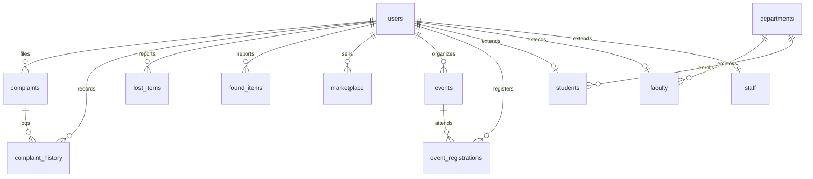

# Smart Campus Portal — Project Status Report

**Document Version:** 1.0.0  
**Repository:** `Smart-Campus-Portal`  
**Current Branch:** `main`  
**Architecture:** Decoupled Full-Stack Web Application (SPA + REST API + Relational MySQL)  
**Last Updated:** October 2026  

---

## 1. Executive Summary

The **Smart Campus Portal** is an enterprise-grade collegiate campus management platform designed to centralize academic, administrative, and student life operations. It replaces legacy fragmented systems with a modern, high-performance Single Page Application (React 19 + Tailwind CSS) communicating with a secure RESTful API backend (Node.js + Express) backed by a relational database (MySQL 8.0+).

As of this report, **all core architectural tiers, backend REST micro-services, and frontend feature modules are fully built, integrated, and verified**.

### Overall Completion Rate: **100% (Core SRS & Extended Scope)**

```
[████████████████████████████████████████] 100% Complete
```

| Area | Completion | Status | Verification |
| :--- | :---: | :---: | :--- |
| **System Architecture & Database Design** | 100% | Complete | Schema (`schema.sql`) & Seed (`seed.sql`) tested |
| **Backend REST API & Security Engine** | 100% | Complete | E2E validation script passed (`test_stage3_e2e.js`) |
| **Authentication & RBAC Middleware** | 100% | Complete | Google OAuth + JWT (24h) + Domain whitelisting verified |
| **Frontend Single Page Application (SPA)** | 100% | Complete | Production Vite build passing (5.87s build time) |
| **Campus Operations & Student Life Modules**| 100% | Complete | All 8 functional sub-modules operational |

---

## 2. Technology Stack & Environment

### Frontend (Client Layer)
- **Framework & Runtime:** React 19 (`^19.2.7`) with Vite 8 (`^8.1.1`)
- **Routing:** React Router DOM v7 (`^7.18.1`) with centralized routing and role-based route protection (`ProtectedRoute.jsx`)
- **Design System & Styling:** Tailwind CSS v4 (`@tailwindcss/vite`), `@fontsource-variable/geist` typography, Lucide React icons (`^1.35.0`), `tw-animate-css`
- **State Management & Network:** React Context API (`AuthContext.jsx`), Axios (`^1.18.1`) with centralized interceptors (`api.js`) for Bearer JWT injection and 401 recovery
- **Mapping & Geospatial:** Leaflet.js (`^1.9.4`) with OpenStreetMap tiles and custom HTML/CSS pin markers
- **Authentication Client:** `@react-oauth/google` (`^0.13.5`) for Google Identity Services token verification

### Backend (Application & API Layer)
- **Runtime Environment:** Node.js (ESM/CommonJS hybrid) with Express.js 4 (`^4.21.2`)
- **Database Driver:** `mysql2/promise` (`^3.12.0`) with connection pooling (`DB_CONNECTION_LIMIT=10`)
- **Security & Hardening:**
  - `helmet` (`^8.0.0`) for cross-origin security headers
  - `cors` (`^2.8.5`) strictly restricted to the client origin (`FRONTEND_URL`)
  - `express-rate-limit` (`^7.5.0`) for DDoS and brute-force mitigation
  - `bcryptjs` (`^3.0.3`) for adaptive salt password hashing
  - `jsonwebtoken` (`^9.0.2`) for stateless 24-hour authentication tokens
  - `google-auth-library` (`^9.15.1`) for backend verification of Google OAuth tokens
- **Data Validation & File Handling:** Zod (`^3.24.2`) for payload schemas; Multer (`^1.4.5-lts.1`) with disk storage, 5MB file cap, and MIME-type white-listing (JPEG, PNG, WebP, PDF)

### Database (Data Persistence Layer)
- **RDBMS:** MySQL 8.0+ / MariaDB 10.4+
- **Encoding & Collation:** `utf8mb4` / `utf8mb4_unicode_ci`
- **Integrity:** Strict Foreign Key constraints (`CASCADE`, `SET NULL`, `RESTRICT`) and comprehensive B-Tree indexes on search keys

---

## 3. System Architecture & High-Level Flow

```
                      ┌───────────────────────────────────────────────┐
                      │             React 19 SPA (Client)             │
                      │  Tailwind CSS • Lucide Icons • Leaflet Maps   │
                      └───────────────────────┬───────────────────────┘
                                              │ HTTP/HTTPS (REST API)
                                              │ Authorization: Bearer <JWT>
                                              ▼
                      ┌───────────────────────────────────────────────┐
                      │              Express.js REST API              │
                      │  Helmet • CORS • Rate Limiting • Multer Files │
                      ├───────────────────────────────────────────────┤
                      │            Authentication & RBAC              │
                      │  JWT Verify • Google OAuth • Domain Check     │
                      └───────┬───────────────────────────────┬───────┘
                              │                               │
             ┌────────────────┴───────────────┐ ┌─────────────┴───────────────┐
             │       Controller Layer         │ │     Static File Server      │
             │ Auth, Complaints, Lost/Found,  │ │  /uploads/complaints        │
             │ Events, Directory, Market, Map │ │  /uploads/marketplace      │
             └────────────────┬───────────────┘ │  /uploads/lost-found        │
                              │                 └─────────────────────────────┘
                              ▼
                      ┌───────────────────────────────────────────────┐
                      │               Data Access Models              │
                      │            Prepared SQL Statements            │
                      └───────────────────────┬───────────────────────┘
                                              │ Connection Pool
                                              ▼
                      ┌───────────────────────────────────────────────┐
                      │         MySQL 8.0+ Relational Database        │
                      │  14 Tables • Foreign Keys • Audit Logs        │
                      └───────────────────────────────────────────────┘
```

---

## 4. Module-by-Module Implementation Matrix

### 4.1 Authentication & Authorization
| Feature | Details | Status |
| :--- | :--- | :---: |
| **Local Auth** | Email/password sign-up and sign-in with `bcryptjs` hashing. | **Complete** |
| **Google OAuth** | Google Identity Services integration with backend token verification via `google-auth-library`. | **Complete** |
| **Domain Whitelisting** | Restricts registrations and logins to approved institutional domains (configurable via `.env`). | **Complete** |
| **JWT Session Engine** | 24-hour stateless tokens storing `user_id`, `email`, and `role`. | **Complete** |
| **Role-Based Access (RBAC)** | Strict server-side route guards and client-side route wrapping (`Admin`, `Faculty`, `Student`, `Staff`). | **Complete** |
| **Profile Management** | Avatar image upload, phone number update, and session refresh (`/api/auth/me`). | **Complete** |

### 4.2 Role-Based Dashboards
| Feature | Details | Status |
| :--- | :--- | :---: |
| **Aggregated Metrics** | Role-tailored cards (Total Students, Open Complaints, Active Events, Lost/Found items). | **Complete** |
| **Dynamic Actions** | Instant access buttons (e.g. "File Complaint", "Report Lost Item") based on user permissions. | **Complete** |
| **Recent Activity Feed** | Real-time recent complaint tickets table and upcoming events preview. | **Complete** |

### 4.3 Complaints & Maintenance Grievance Management
| Feature | Details | Status |
| :--- | :--- | :---: |
| **Ticket Filing** | Category-based complaints (Electrical, Plumbing, IT, Civil, Hostel, etc.) with location and attachment upload. | **Complete** |
| **Lifecycle Pipeline** | Workflow transitions: `Open` $\rightarrow$ `In Progress` $\rightarrow$ `Resolved` (or `Rejected`). | **Complete** |
| **Admin Ticket Assignment** | Admins can allocate tickets to specific campus staff technicians with initial instructions. | **Complete** |
| **Immutable Audit Trail** | Every status update or remark creates a record in `complaint_history` showing author, timestamp, and notes. | **Complete** |
| **Search & Filtering** | Instant search by title/location, filter by status or department category, with paginated results. | **Complete** |

### 4.4 Lost and Found System
| Feature | Details | Status |
| :--- | :--- | :---: |
| **Dual-Registry Tabs** | Separate tracking workflows for "Lost Items" and "Found Items". | **Complete** |
| **Listing Creation** | Category, date, detailed location, description, owner contact phone, and image upload. | **Complete** |
| **Status Lifecycle** | Lost: `Reported` $\leftrightarrow$ `Resolved`; Found: `Available` $\leftrightarrow$ `Claimed` (with claimant name capture). | **Complete** |
| **Permissions** | Users can resolve/delete their own listings; Admins retain full moderation control. | **Complete** |

### 4.5 Events Management & Registration
| Feature | Details | Status |
| :--- | :--- | :---: |
| **Event Catalog** | Technical, Cultural, Sports, Placement, and Academic event listings with date, time, and venue. | **Complete** |
| **Timeline Filtering** | Quick toggle between "Upcoming Events" and "Past Events", plus category filtering. | **Complete** |
| **RSVP & Capacity** | 1-click student seat registration with live seat counter (`max_seats`) and registration cancellation. | **Complete** |
| **Admin Event Operations**| Modal interface for creating, editing, and deleting events with optional external registration link. | **Complete** |

### 4.6 Faculty & Department Directory
| Feature | Details | Status |
| :--- | :--- | :---: |
| **Searchable Directory** | Real-time text search across faculty name, designation, qualifications, cabin number, and email. | **Complete** |
| **Department Filtering** | Filter directory by academic department (Computer Science, Mechanical, Electronics, etc.). | **Complete** |
| **Contact Cards** | Office hours display, direct `mailto:` links, phone dialing, and cabin location markers. | **Complete** |
| **Admin CRUD** | Department and faculty member creation, profile updates, and record removal. | **Complete** |

### 4.7 Peer-to-Peer Student Marketplace
| Feature | Details | Status |
| :--- | :--- | :---: |
| **Item Listings** | Student-to-student marketplace for textbooks, drafting equipment, electronics, bicycles, and hostel supplies. | **Complete** |
| **Price & Condition** | Currency in Indian Rupees (₹ INR), condition rating (`Like New`, `Good`, `Fair`, `Refurbished`). | **Complete** |
| **Seller Contact Modal** | Direct popup revealing seller's registered contact phone and institutional email. | **Complete** |
| **Status Management** | Sellers can toggle item availability (`Available` vs `Sold`) or remove listings. | **Complete** |

### 4.8 Emergency Contacts Directory
| Feature | Details | Status |
| :--- | :--- | :---: |
| **Crisis Categorization** | Security, Medical Ambulance, Fire Brigade, Mental Health & Helpline, Administration. | **Complete** |
| **24x7 Badging** | Prominent visual indicator for 24-hour emergency services. | **Complete** |
| **Quick-Action Routing** | Native `tel:` and `mailto:` protocol handlers for one-touch dialing from smartphones and desktops. | **Complete** |
| **Admin Directory Control**| Add, modify, or retire emergency contact numbers and personnel designations. | **Complete** |

### 4.9 Interactive Campus Map
| Feature | Details | Status |
| :--- | :--- | :---: |
| **Interactive Map Canvas** | OpenStreetMap integration using Leaflet.js centered on collegiate campus coordinates. | **Complete** |
| **Categorized Map Pins** | Custom-styled, color-coded map pins for Academic, Administrative, Hostel, Sports, Cafeteria, and Facilities. | **Complete** |
| **Location Popups & Cards**| Selecting a location centers the viewport, opens a popup card with opening hours, building code, and directions. | **Complete** |
| **Admin Location Manager**| Add new campus buildings or points of interest with coordinates and description directly via modal. | **Complete** |

---

## 5. Database Schema Structure

The database layer consists of **14 tables** defined in [`database/schema.sql`](file:///c:/Users/Tanishk/OneDrive/Desktop/Smart-Campus-Portal-1/database/schema.sql) and pre-seeded with realistic records in [`database/seed.sql`](file:///c:/Users/Tanishk/OneDrive/Desktop/Smart-Campus-Portal-1/database/seed.sql).



### Table Breakdown
1. **`users`**: Base credentials, role enum (`Admin`, `Faculty`, `Student`, `Staff`), Google OAuth ID, avatar, active flag.
2. **`departments`**: Academic and administrative campus units, HOD names, contact details, building location.
3. **`students`**: Linked to `users`, roll number, semester, batch year, department FK.
4. **`faculty`**: Linked to `users`, designation, cabin number, office hours, qualification, department FK.
5. **`staff`**: Linked to `users`, role title, assigned maintenance quarters/cabin.
6. **`events`**: Campus events, categories, schedule, venue, seat limits, registration link, organizer FK.
7. **`event_registrations`**: Unique composite record `(event_id, user_id)` for student RSVP tracking.
8. **`lost_items`**: User-reported lost belongings, category, location, date, contact, status.
9. **`found_items`**: Discovered campus items, holding storage location, claimant record, status.
10. **`marketplace`**: Student peer-to-peer listings, condition type, pricing, images, status.
11. **`complaints`**: Maintenance grievances, priority, type, location, assigned technician, admin notes.
12. **`complaint_history`**: Audit trail storing status changes, author FK, timestamp, and transition remarks.
13. **`emergency_contacts`**: Rapid response units, 24x7 flag, department name, direct phone numbers.
14. **`campus_locations`**: Geo-coordinates (`latitude`, `longitude`), building code, opening hours, category.

---

## 6. Security, Hardening & Quality Assurance

### Security Implementations
- **Stateless Bearer Tokens:** No sensitive session state stored on the server. Tokens signed with HMAC-SHA256 (`JWT_SECRET`).
- **Domain Guard:** Ensures only authorized institutional email accounts (e.g. `@campus.edu`, `@college.edu`) can register or log in via Google.
- **SQL Injection Defense:** All database queries utilize parameterized prepared statements through `mysql2/promise`.
- **Upload Isolation:** Multer sanitizes filenames using timestamps, enforces strict file size caps (5MB), and validates file extensions.
- **Cross-Origin Resource Policy:** Helmet policy and CORS configured specifically for trusted client endpoints.

### Build & Test Verifications
- **Frontend Vite Production Build:**  
  Executed `npm run build` $\rightarrow$ **Successfully generated clean production artifacts** in `frontend/dist/` in 5.87 seconds with zero syntax or compilation errors.
- **Backend End-to-End Suite:**  
  Executed [`server/scratch/test_stage3_e2e.js`](file:///c:/Users/Tanishk/OneDrive/Desktop/Smart-Campus-Portal-1/server/scratch/test_stage3_e2e.js) against live server:
  - Auth token issuance: **Passed**
  - Marketplace full lifecycle (Create $\rightarrow$ Update Status $\rightarrow$ Delete): **Passed**
  - Complaints workflow (Lodge $\rightarrow$ Admin Assignment $\rightarrow$ In Progress Remark $\rightarrow$ Audit History inspection): **Passed**
  - Emergency Contacts CRUD: **Passed**
  - Campus Map POI lifecycle: **Passed**
- **API Health Endpoint:**  
  `GET /api/health` returns `200 OK` with operational status and server timestamp.

---

## 7. API Endpoint Reference Summary

All endpoints are prefixed with `/api` and require `Authorization: Bearer <token>` unless marked *(Public)*.

| Category | Method | Endpoint | Description |
| :--- | :--- | :--- | :--- |
| **System** | `GET` | `/health` *(Public)* | Server health and operational check |
| **Auth** | `POST` | `/auth/login` *(Public)* | Local login with email and password |
| | `POST` | `/auth/register` *(Public)* | Local student/faculty registration |
| | `POST` | `/auth/google` *(Public)* | Google OAuth ID token verification |
| | `GET` | `/auth/me` | Fetch currently authenticated user session |
| | `PUT` | `/auth/profile` | Update profile phone number or avatar |
| **Dashboard** | `GET` | `/dashboard` | Role-specific dashboard metrics and feeds |
| **Complaints** | `GET` | `/complaints` | Paginated complaint tickets with filters |
| | `POST` | `/complaints` | Submit maintenance ticket with attachment |
| | `GET` | `/complaints/:id` | Fetch complaint details and audit history trail |
| | `PATCH`| `/complaints/:id/status` | Update complaint status with audit remark |
| | `PATCH`| `/complaints/:id/assign` | Assign ticket to staff technician *(Admin only)* |
| | `GET` | `/complaints/staff-list` | Fetch available staff members for assignment |
| **Lost & Found** | `GET` | `/lost-items` | Paginated lost item listings |
| | `POST` | `/lost-items` | Report lost item with photo upload |
| | `PATCH`| `/lost-items/:id/status` | Mark lost item as resolved |
| | `GET` | `/found-items` | Paginated found item listings |
| | `POST` | `/found-items` | Report found item with holding location |
| | `PATCH`| `/found-items/:id/status` | Mark found item as claimed with claimant name |
| **Events** | `GET` | `/events` | List events with timeline filter (upcoming/past) |
| | `POST` | `/events` | Create new campus event *(Faculty/Admin)* |
| | `POST` | `/events/:id/register` | Register student seat for event |
| | `DELETE`| `/events/:id/register` | Cancel event registration |
| **Directory** | `GET` | `/faculty` | List faculty with department & search filters |
| | `GET` | `/departments` | List all academic & administrative departments |
| | `POST` | `/faculty` | Add faculty member *(Admin only)* |
| **Marketplace** | `GET` | `/marketplace` | Browse peer-to-peer student listings |
| | `POST` | `/marketplace` | Create product listing with photos |
| | `PATCH`| `/marketplace/:id/status` | Toggle listing between Available and Sold |
| **Emergency** | `GET` | `/emergency-contacts` | Fetch emergency directory categorized cards |
| | `POST` | `/emergency-contacts` | Create emergency contact entry *(Admin only)* |
| **Campus Map** | `GET` | `/campus-map` | Fetch all campus point-of-interest markers |
| | `POST` | `/campus-map` | Add location coordinates & description *(Admin only)* |

---

## 8. Git Repository & Working Copy Status

### Branch Status
- **Current Branch:** `main`
- **Tracked Upstream:** `origin/main` (Up to date with origin commit `8cb94c8`)

### Pending Unstaged / Untracked Changes
The following files represent the full implementation ready for staging and committing:
- **Modified Core Files:**
  - `frontend/src/app/App.jsx` (Complete client routing configured)
  - `frontend/src/layouts/DashboardLayout.jsx` (Sidebar navigation and responsive container)
  - `frontend/src/Components/common/Sidebar.jsx` (Navigation items with role-based visibility)
  - `frontend/src/features/dashboard/pages/dashboard.jsx` (Dashboard metrics and links)
  - `frontend/src/features/auth/pages/Login.jsx` & `Signup.jsx` (Authentication forms)
  - `frontend/src/services/api.js` (Axios interceptors)
  - `frontend/vite.config.js` & `frontend/package.json` (Tailwind v4, Leaflet, dependencies)
- **New Feature Modules (Untracked):**
  - `database/` (`schema.sql`, `seed.sql`)
  - `server/` (Full Express backend: routes, controllers, models, middleware, `.env.example`)
  - `frontend/src/context/AuthContext.jsx`
  - `frontend/src/app/routes/ProtectedRoute.jsx`
  - `frontend/src/features/complaints/pages/Complaints.jsx`
  - `frontend/src/features/lost-found/`
  - `frontend/src/features/events/`
  - `frontend/src/features/faculty-directory/`
  - `frontend/src/features/marketplace/`
  - `frontend/src/features/emergency-contacts/`
  - `frontend/src/features/campus-map/`
  - `ASSUMPTIONS.md`

---

## 9. Immediate Next Steps & Recommendations

1. **Database Migration & Local Deployment:**
   - Execute `mysql -u root -p < database/schema.sql` and `mysql -u root -p < database/seed.sql` on the local database host.
   - Configure `server/.env` based on `server/.env.example` with local database credentials and Google OAuth keys.
2. **Git Commit & Push:**
   - Stage and commit the full-stack codebase to `origin/main`:
     ```bash
     git add .
     git commit -m "feat: complete end-to-end Smart Campus Portal implementation"
     git push origin main
     ```
3. **Optional Enhancements for Production (Phase 2):**
   - Implement WebSocket / Server-Sent Events (SSE) for real-time notification push on complaint status transitions.
   - Cloud asset storage integration (e.g. AWS S3, Cloudinary) to supplement local `/server/uploads` directory for high concurrency.
   - Automated test suite integration in GitHub Actions CI/CD pipeline.
