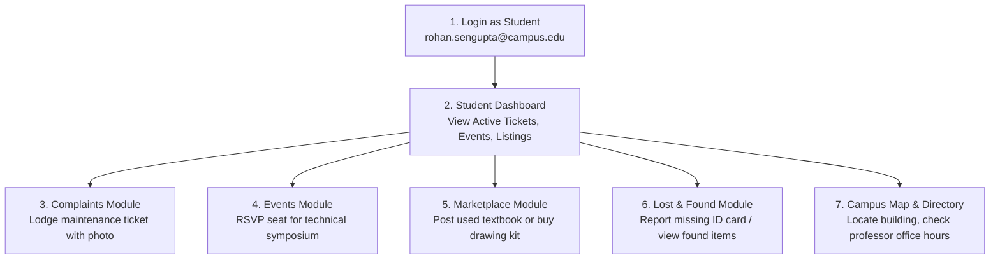
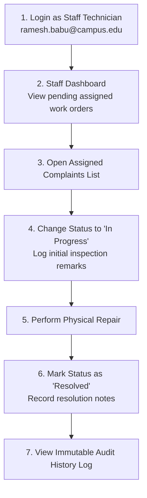
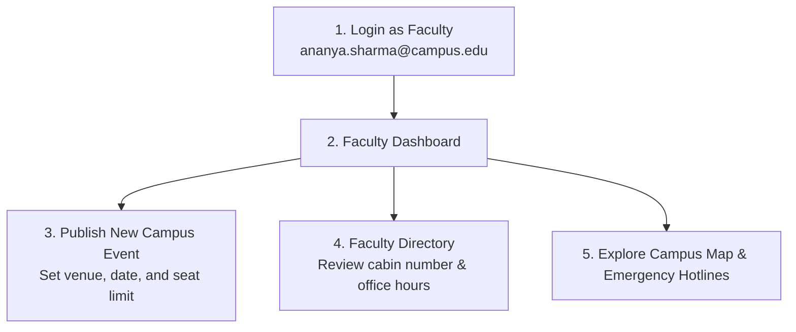
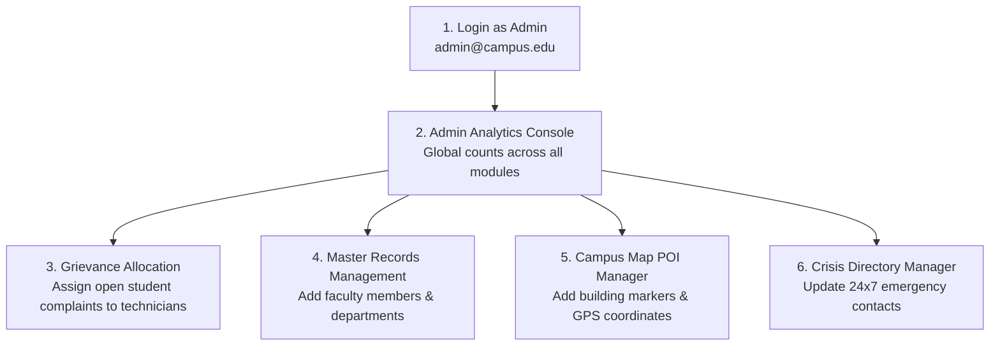

# Smart Campus Portal — User Guide & Role-Based Flow Manual

**Version:** 1.0.0  
**Stack:** React 19 + Tailwind CSS | Node.js + Express.js | MySQL 8.0+ | JWT + Google OAuth  
**Target Audience:** Students, Faculty, Campus Staff, Administrators, Evaluators & Testers  

---

## Table of Contents
1. [Pre-Seeded Login Credentials](#1-pre-seeded-login-credentials)
2. [Quick-Start & Environment Setup](#2-quick-start--environment-setup)
3. [System Architecture & Role Permissions](#3-system-architecture--role-permissions)
4. [Step-by-Step User Role Walkthroughs](#4-step-by-step-user-role-walkthroughs)
   - 4.1 [Student Flow](#41-student-flow)
   - 4.2 [Staff / Maintenance Technician Flow](#42-staff--maintenance-technician-flow)
   - 4.3 [Faculty Flow](#43-faculty-flow)
   - 4.4 [Administrator Flow](#44-administrator-flow)
5. [End-to-End Feature Verification Guide](#5-end-to-end-feature-verification-guide)
   - [Grievance Redressal (Complaints & Audit Trail)](#feature-1-grievance-redressal--maintenance-pipeline)
   - [Events & Live Seat RSVP](#feature-2-campus-events--seat-rsvp)
   - [Lost & Found Dual-Registry](#feature-3-lost--found-recovery-system)
   - [Peer-to-Peer Student Marketplace](#feature-4-peer-to-peer-student-marketplace)
   - [Faculty & Department Directory](#feature-5-faculty--department-directory)
   - [Interactive Leaflet Campus Map](#feature-6-interactive-geospatial-campus-map)
   - [Emergency Hotlines & 1-Touch Dialing](#feature-7-emergency-contacts-directory)
6. [Troubleshooting & FAQs](#6-troubleshooting--faqs)

---

## 1. Pre-Seeded Login Credentials

All pre-seeded test accounts use the **same default password**:

> 🔑 **Default Password for All Seeded Accounts:** `Password@123`

### Complete Test User Roster

| Role | Name | Institutional Email | Password | Primary Capabilities |
| :--- | :--- | :--- | :--- | :--- |
| **🛡️ Admin** | Prof. Vikramaditya Sen | `admin@campus.edu` | `Password@123` | Full system control, allocate complaints to technicians, add faculty/departments, manage map POIs and crisis contacts. |
| **👨‍🏫 Faculty** | Dr. Ananya Sharma | `ananya.sharma@campus.edu` | `Password@123` | Computer Science Assoc. Professor; publish academic/tech events, view attendees, consult directory. |
| **👨‍🏫 Faculty** | Prof. K. R. Ramanathan | `kr.ramanathan@campus.edu` | `Password@123` | Electronics Professor; publish workshops, consult directory. |
| **👨‍🏫 Faculty** | Dr. Sneha Kulkarni | `sneha.kulkarni@campus.edu` | `Password@123` | Mechanical Asst. Professor; publish robotics contests. |
| **🛠️ Staff** | Ramesh Babu | `ramesh.babu@campus.edu` | `Password@123` | Facilities & Maintenance Coordinator; inspect and resolve electrical, plumbing, civil grievances. |
| **🛠️ Staff** | Sunita Deshmukh | `sunita.deshmukh@campus.edu` | `Password@123` | Senior Systems Administrator; inspect and resolve IT & campus network tickets. |
| **🎓 Student** | Rohan Sengupta | `rohan.sengupta@campus.edu` | `Password@123` | CSE Year 3; file complaints, RSVP for events, post goods on marketplace, report lost items. |
| **🎓 Student** | Priya Nambiar | `priya.nambiar@campus.edu` | `Password@123` | ECE Year 3; RSVP for events, search faculty cabins, claim found items. |
| **🎓 Student** | Aditya Vardhan | `aditya.vardhan@campus.edu` | `Password@123` | MECH Year 2; browse marketplace, view campus map. |
| **🎓 Student** | Tanvi Agarwal | `tanvi.agarwal@campus.edu` | `Password@123` | IT Year 2; file hostel/sanitation complaints, call emergency hotlines. |

---

## 2. Quick-Start & Environment Setup

### 2.1 Database Setup (MySQL 8.0+)
Make sure your local MySQL service is running, then load the schema and seeds:
```bash
# 1. Open MySQL CLI or Workbench and run:
mysql -u root -p < database/schema.sql
mysql -u root -p < database/seed.sql
```
This initializes the `smart_campus` database with **14 normalized tables** and seeded test records.

### 2.2 Backend API Server Configuration & Startup
1. Navigate to the `server/` directory:
   ```bash
   cd server
   ```
2. Verify `server/.env` exists (copy from `.env.example` if needed):
   ```env
   PORT=5000
   NODE_ENV=development
   FRONTEND_URL=http://localhost:5173

   # Database Credentials
   DB_HOST=localhost
   DB_PORT=3306
   DB_USER=root
   DB_PASSWORD=your_mysql_password
   DB_NAME=smart_campus
   DB_CONNECTION_LIMIT=10

   # Security & JWT
   JWT_SECRET=super_secret_jwt_key_smart_campus_2026
   JWT_EXPIRES_IN=24h

   # Allowed Institutional Domains (comma-separated)
   ALLOWED_EMAIL_DOMAINS=campus.edu,college.edu
   ```
3. Start the backend API server:
   ```bash
   npm run dev
   ```
   *Expected output:* `[Server] Running on port 5000` & `[DB] Connected successfully to smart_campus`.

### 2.3 Frontend Client Application Startup
1. Open a second terminal and navigate to `frontend/`:
   ```bash
   cd frontend
   ```
2. Start the Vite development server:
   ```bash
   npm run dev
   ```
3. Open your browser and navigate to:
   ```
   http://localhost:5173
   ```

---

## 3. System Architecture & Role Permissions

The portal enforces strict **Role-Based Access Control (RBAC)** across the UI and API:

| Feature / Module | Student | Faculty | Staff (Technician) | Admin |
| :--- | :---: | :---: | :---: | :---: |
| **Role Dashboard** | ✅ Own Metrics | ✅ Own Metrics | ✅ Assigned Tasks | ✅ Global Analytics |
| **Lodge Grievance** | ✅ Yes | ❌ No | ❌ No | ❌ No |
| **Assign Grievance to Staff** | ❌ No | ❌ No | ❌ No | ✅ Yes |
| **Update Work Order Status** | ❌ No | ❌ No | ✅ Yes (Assigned) | ✅ Yes |
| **View Audit Trail History** | ✅ Own Tickets | ❌ No | ✅ Assigned Tickets| ✅ All Tickets |
| **Browse Events & Seat RSVP**| ✅ Yes | ✅ View Only | ✅ View Only | ✅ View Only |
| **Publish Campus Event** | ❌ No | ✅ Yes | ❌ No | ✅ Yes |
| **P2P Marketplace (Buy/Sell)**| ✅ Full CRUD | ❌ No | ❌ No | ✅ Moderation |
| **Lost & Found System** | ✅ Full Access | ✅ Full Access | ✅ Full Access | ✅ Moderation |
| **Faculty & Dept Directory** | 👁️ Search/View | 👁️ Search/View | 👁️ Search/View | ✅ Add/Edit/Delete |
| **Campus Map & GIS Pins** | 👁️ Interactive | 👁️ Interactive | 👁️ Interactive | ✅ Add POI Markers |
| **Emergency Contacts** | 📞 1-Touch Dial | 📞 1-Touch Dial | 📞 1-Touch Dial | ✅ Manage Hotlines |

---

## 4. Step-by-Step User Role Walkthroughs

### 4.1 Student Flow



#### Step-by-step actions:
1. **Login:**
   - Go to `http://localhost:5173/login`.
   - Email: `rohan.sengupta@campus.edu` | Password: `Password@123`.
   - Notice the redirect to `/dashboard` showing student metrics (Total Tickets, Registered Events, Active Marketplace Items).
2. **File a Complaint:**
   - Click **"Complaints"** in the sidebar (or click the **"File Complaint"** quick action).
   - Click **"+ New Complaint"**.
   - Select Category: `Electrical`, Title: `Faulty Tube Light in Room 304`, Location: `Hostel Block B, 3rd Floor`.
   - Optionally attach a photo (under 5MB).
   - Click **Submit**. The ticket appears in the complaints list with badge `Open`.
3. **Register for an Event (RSVP):**
   - Click **"Events"** in the sidebar.
   - Look at *"National Tech Symposium: ApexInnovate 2026"*.
   - Click **"RSVP Seat"**. Notice the instant confirmation badge and the live seat counter decrementing available seats.
4. **Peer-to-Peer Marketplace:**
   - Click **"Marketplace"** in the sidebar.
   - Click **"+ Sell Item"**.
   - Enter Title: `Calculus & Linear Algebra 3rd Edition`, Category: `Textbooks`, Price: `450`, Condition: `Good`, Phone: `9741011001`.
   - Submit the listing. It appears immediately in the campus marketplace feed with an **"Available"** tag.
   - Click on any other listing to open the **Seller Contact Modal** displaying the seller's verified campus phone and email.

---

### 4.2 Staff / Maintenance Technician Flow



#### Step-by-step actions:
1. **Login:**
   - Log out from any active session.
   - Go to `/login` and enter:
     - Email: `ramesh.babu@campus.edu` | Password: `Password@123`.
2. **Review Assigned Work Orders:**
   - On the dashboard, see the count of tickets assigned to you.
   - Click **"Complaints"** in the sidebar.
   - The view filters automatically to grievances allocated to your maintenance team.
3. **Progress the Ticket Lifecycle:**
   - Click on ticket details.
   - Click **"Update Status"**.
   - Change status from `Open` to `In Progress`.
   - Add remark: *"Inspected site; requisitioned replacement ballast and LED tube."*
   - Click **Submit**. Notice the audit timeline appends this remark with your name and timestamp.
4. **Resolve the Ticket:**
   - Once work is complete, click **"Update Status"** again.
   - Set status to `Resolved`.
   - Add remark: *"Replaced fixture and verified lighting circuit. Operational."*
   - The ticket badge updates to green `Resolved`.

---

### 4.3 Faculty Flow



#### Step-by-step actions:
1. **Login:**
   - Email: `ananya.sharma@campus.edu` | Password: `Password@123`.
2. **Publish an Event:**
   - Click **"Events"** in the sidebar.
   - Notice that Faculty members have access to the **"+ Create Event"** button (students do not).
   - Enter Event Title: `Guest Lecture: Quantum Algorithms by IBM Research`.
   - Category: `Technical`, Venue: `Auditorium 2`, Date: Choose an upcoming date, Max Seats: `120`.
   - Click **Publish**. The event is broadcast immediately to all student and faculty dashboards.
3. **Inspect Directory:**
   - Click **"Faculty Directory"**. Search your own name to verify cabin number (`AB-3 412`) and office hours.

---

### 4.4 Administrator Flow



#### Step-by-step actions:
1. **Login:**
   - Email: `admin@campus.edu` | Password: `Password@123`.
   - Notice the high-level **Admin Overview** showing total students registered, unresolved grievances, active events, and marketplace listings.
2. **Triage & Assign Maintenance Complaints:**
   - Navigate to **"Complaints"**. Admins see ALL tickets campus-wide.
   - Find an `Open` ticket lodged by a student.
   - Click **"Assign Staff"**.
   - Select a technician (e.g. `Ramesh Babu` or `Sunita Deshmukh`).
   - Add admin instructions: *"Urgent: Handle before 4:00 PM today."*
   - Click **Assign**. The ticket is updated and an immutable entry is added to `complaint_history`.
3. **Manage Campus POIs & Emergency Hotlines:**
   - Open **"Campus Map"** $\rightarrow$ Click **"+ Add Location"** to drop a new building marker with coordinates and opening hours.
   - Open **"Emergency Contacts"** $\rightarrow$ Click **"+ Add Contact"** to register or update security, ambulance, or counselor hotlines.

---

## 5. End-to-End Feature Verification Guide

Use this checklist to test and verify every module of the portal:

### Feature 1: Grievance Redressal & Maintenance Pipeline
1. Log in as **Student** (`rohan.sengupta@campus.edu`).
2. Submit a complaint under Category `Plumbing` with title `Water pressure issue in 2nd Floor Washroom`.
3. Verify ticket appears in student list with status `Open`.
4. Log out and log in as **Admin** (`admin@campus.edu`).
5. Open Complaints, click **"Assign Staff"**, and assign the ticket to `Ramesh Babu`.
6. Log out and log in as **Staff** (`ramesh.babu@campus.edu`).
7. Open Complaints $\rightarrow$ Ticket is present $\rightarrow$ Change status to `In Progress` $\rightarrow$ Change status to `Resolved`.
8. Log in back as **Student** $\rightarrow$ Open ticket $\rightarrow$ Inspect the **Audit History Timeline** showing timestamps, author names, and status transitions.

### Feature 2: Campus Events & Seat RSVP
1. Log in as **Student** (`priya.nambiar@campus.edu`).
2. Go to **Events** $\rightarrow$ Switch between **"Upcoming Events"** and **"Past Events"** tabs.
3. Click **"RSVP Seat"** on an upcoming event $\rightarrow$ Seat count increments by 1.
4. Try clicking RSVP again $\rightarrow$ System prevents duplicate registration.
5. Click **"Cancel Registration"** $\rightarrow$ RSVP is safely withdrawn and seat is released.

### Feature 3: Lost & Found Recovery System
1. Go to **Lost & Found** in sidebar.
2. Switch between **"Lost Items"** and **"Found Items"** tabs.
3. Click **"+ Report Lost Item"** $\rightarrow$ Enter item details and contact phone.
4. As the item owner (or Admin), test clicking **"Mark Resolved"** $\rightarrow$ Badge updates to `Resolved`.
5. For a found item, click **"Claim Item"** $\rightarrow$ Input claimant name $\rightarrow$ Badge updates to `Claimed`.

### Feature 4: Peer-to-Peer Student Marketplace
1. As **Student** (`rohan.sengupta@campus.edu`), go to **Marketplace**.
2. Click **"+ Sell Item"** $\rightarrow$ Fill out product info with price in INR ₹.
3. Test the search bar and category filters (e.g., *Textbooks*, *Electronics*, *Bicycles*).
4. Click on any listing card to open the **Seller Contact Modal** $\rightarrow$ Click phone number to trigger native `tel:` dialer.
5. As the owner of the listing, click **"Mark as Sold"** $\rightarrow$ Card updates to `Sold`.

### Feature 5: Faculty & Department Directory
1. Go to **Faculty Directory**.
2. Type in search bar: `Distributed Systems` or `IIT Bombay` $\rightarrow$ Instantly filters to Dr. Ananya Sharma.
3. Use the department dropdown: Filter by `Electronics & Communication` or `Mechanical Engineering`.
4. Check contact card: Office hours, cabin location, and clickable `mailto:` link.

### Feature 6: Interactive Geospatial Campus Map
1. Go to **Campus Map**.
2. Leaflet map renders with custom markers for academic blocks, hostels, cafeteria, and sports facilities.
3. Click any category filter button (e.g. `Hostel`, `Academic`, `Cafeteria`) $\rightarrow$ Pins update dynamically.
4. Click any map pin $\rightarrow$ View popup with building code, opening hours, and description.

### Feature 7: Emergency Contacts Directory
1. Go to **Emergency Contacts** (accessible to all logged-in users and guests).
2. Review categorized hotlines: *Campus Security, Medical Emergency, Fire Station, Student Helpline*.
3. Click any telephone badge $\rightarrow$ Automatically opens telephone dialer (`tel:+91...`).

---

## 6. Troubleshooting & FAQs

### Q1: Login fails with "Invalid credentials"
- **Solution:** Verify you are using `Password@123` (case-sensitive).
- Check that `database/seed.sql` has been executed on your MySQL database.

### Q2: Registration rejected with "Institutional domain required"
- **Solution:** The system enforces an institutional email domain whitelist (`@campus.edu` or `@college.edu`). Use an email address ending in `@campus.edu` when signing up.

### Q3: Server returns `ECONNREFUSED` or database error
- **Solution:** Verify that your MySQL server is running on port 3306 and that `server/.env` contains your correct `DB_PASSWORD`.

### Q4: Images fail to upload or return an error
- **Solution:** Attachments are capped at **5MB** and must be valid image formats (`JPEG`, `PNG`, `WebP`) or `PDF`. Ensure the `server/uploads/` directory exists and has write permissions.

### Q5: How do I switch roles quickly?
- **Solution:** Click the user profile icon in the top navbar $\rightarrow$ Click **"Logout"** $\rightarrow$ Sign in with any of the credentials listed in [Section 1](#1-pre-seeded-login-credentials).

---

*For detailed formal specifications and architecture diagrams, refer to [docs/SRS_DOCUMENT.md](file:///c:/Users/Tanishk/OneDrive/Desktop/Smart-Campus-Portal-1/docs/SRS_DOCUMENT.md).*
