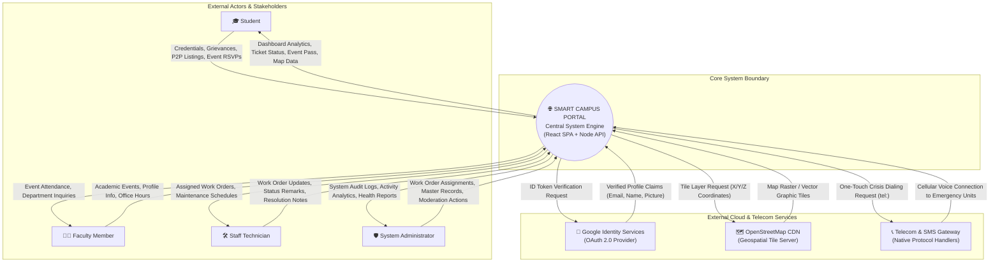
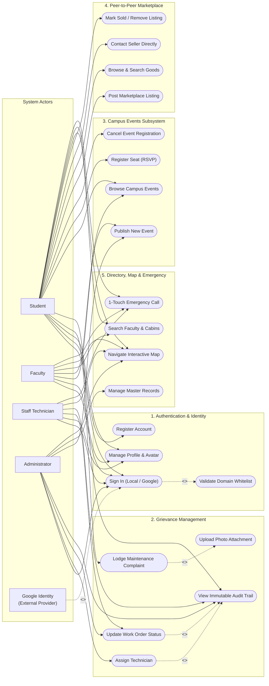
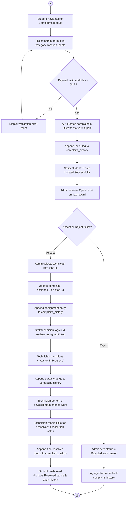
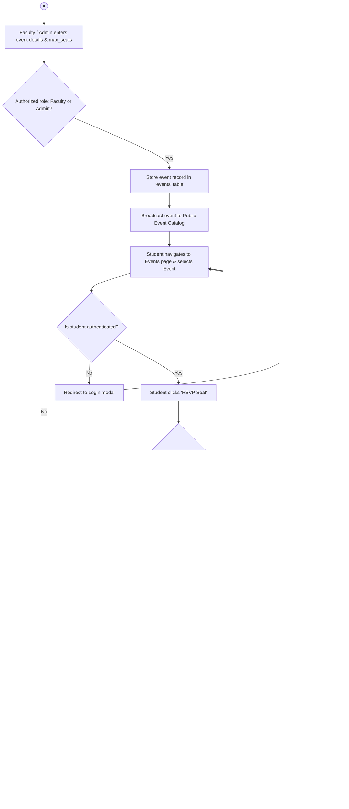
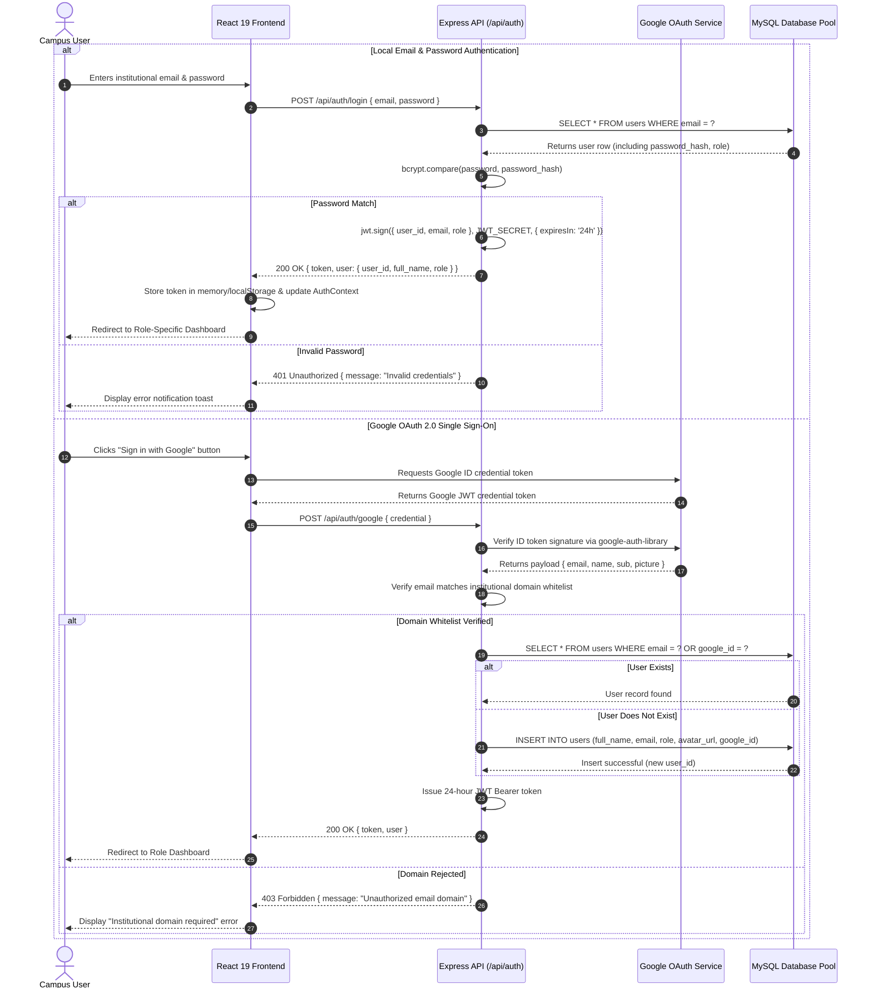
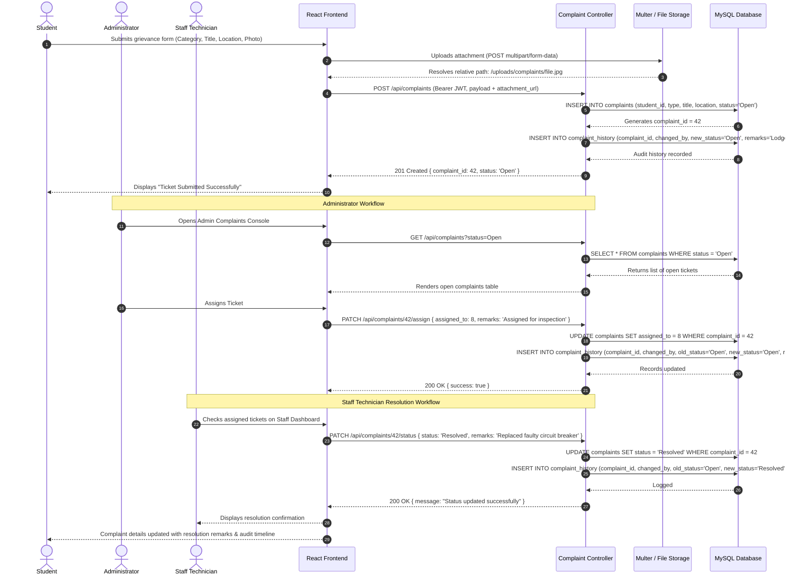
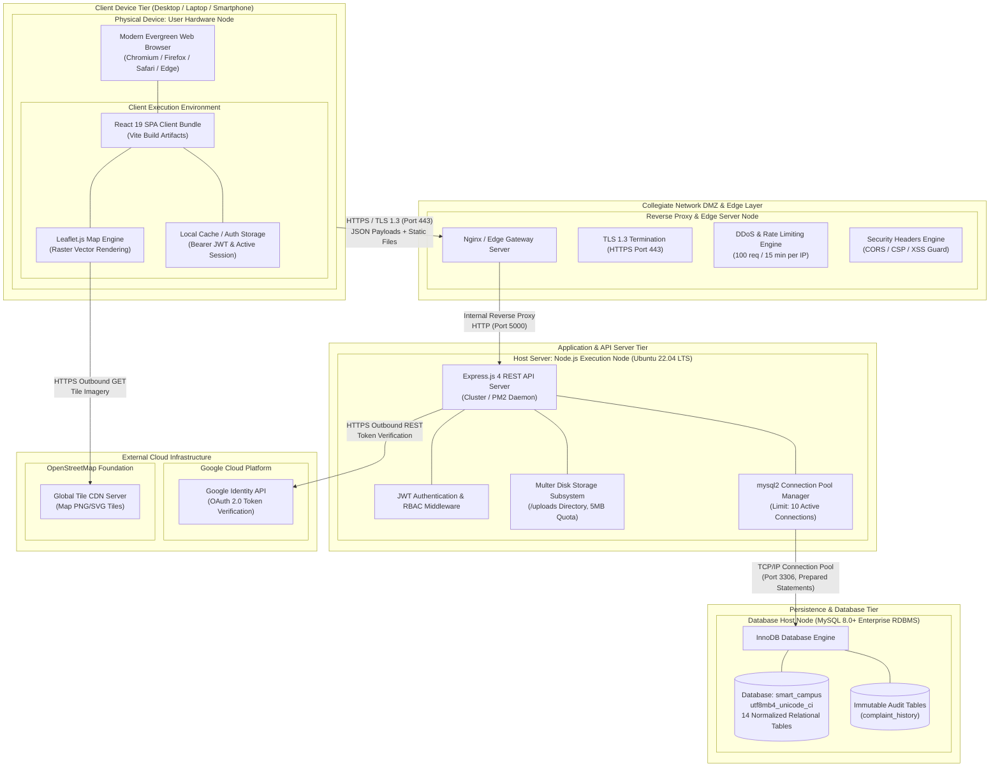

# SOFTWARE REQUIREMENTS SPECIFICATION (SRS)
## SMART CAMPUS PORTAL

**Document Version:** 1.0.0  
**Standard Compliance:** IEEE Std 830-1998 / ISO/IEC/IEEE 29148:2018  
**Project Identifier:** `SCP-2026-PROD`  
**Security Classification:** Collegiate Confidential / Internal Academic  
**Date of Publication:** October 2026  
**Status:** Approved & Verified Specification  

---

### Executive Sign-Off & Approval Matrix

| Role | Designee / Title | Approval Status | Date |
| :--- | :--- | :--- | :--- |
| **Lead Software Architect** | Lead Technical Engineer, Campus Solutions | Approved | 2026-10-07 |
| **Lead Database Administrator**| Senior DBA, Campus Computing Facility | Approved | 2026-10-07 |
| **Dean of Student Affairs** | Academic & Campus Life Governance | Approved | 2026-10-07 |
| **Director of Campus Infrastructure** | Physical Plant, Security & Works Dept. | Approved | 2026-10-07 |

---

## TABLE OF CONTENTS

1. [Introduction](#1-introduction)
   - 1.1 [Purpose](#11-purpose)
   - 1.2 [Document Conventions](#12-document-conventions)
   - 1.3 [Intended Audience & Reading Suggestions](#13-intended-audience--reading-suggestions)
   - 1.4 [Project Scope](#14-project-scope)
   - 1.5 [References](#15-references)
2. [Overall Description](#2-overall-description)
   - 2.1 [Product Perspective](#21-product-perspective)
   - 2.2 [Product Functions Summary](#22-product-functions-summary)
   - 2.3 [User Classes and Characteristics](#23-user-classes-and-characteristics)
   - 2.4 [Operating Environment](#24-operating-environment)
   - 2.5 [Design and Implementation Constraints](#25-design-and-implementation-constraints)
   - 2.6 [Assumptions and Dependencies](#26-assumptions-and-dependencies)
3. [System Modeling & Mandatory Architecture Diagrams](#3-system-modeling--mandatory-architecture-diagrams)
   - 3.1 [Context Diagram (System Level 0 Block Diagram)](#31-context-diagram-system-level-0-block-diagram)
   - 3.2 [Use Case Diagram & Detailed Specifications](#32-use-case-diagram--detailed-specifications)
   - 3.3 [Data Flow Diagrams (DFD Level 0 and Level 1)](#33-data-flow-diagrams-dfd-level-0-and-level-1)
   - 3.4 [Entity-Relationship (E-R) Diagram](#34-entity-relationship-e-r-diagram)
   - 3.5 [Activity Diagrams (Operational Workflows)](#35-activity-diagrams-operational-workflows)
   - 3.6 [Sequence Diagrams (Inter-Component Interactions)](#36-sequence-diagrams-inter-component-interactions)
   - 3.7 [Class Diagram (Static Domain & Object Model)](#37-class-diagram-static-domain--object-model)
   - 3.8 [Deployment Diagram (Physical & Cloud Infrastructure)](#38-deployment-diagram-physical--cloud-infrastructure)
4. [Specific Functional Requirements](#4-specific-functional-requirements)
   - 4.1 [User Authentication & RBAC Engine (AUTH)](#41-user-authentication--rbac-engine-auth)
   - 4.2 [Role-Tailored Dashboards & Metrics (DASH)](#42-role-tailored-dashboards--metrics-dash)
   - 4.3 [Maintenance Grievance Redressal System (COMP)](#43-maintenance-grievance-redressal-system-comp)
   - 4.4 [Lost and Found Central Registry (LF)](#44-lost-and-found-central-registry-lf)
   - 4.5 [Campus Events & RSVP Management (EVT)](#45-campus-events--rsvp-management-evt)
   - 4.6 [Faculty & Departmental Directory (DIR)](#46-faculty--departmental-directory-dir)
   - 4.7 [Peer-to-Peer Student Marketplace (MKT)](#47-peer-to-peer-student-marketplace-mkt)
   - 4.8 [Emergency Crisis Contacts Directory (EMG)](#48-emergency-crisis-contacts-directory-emg)
   - 4.9 [Interactive Geospatial Campus Map (MAP)](#49-interactive-geospatial-campus-map-map)
5. [External Interface Requirements](#5-external-interface-requirements)
   - 5.1 [User Interfaces](#51-user-interfaces)
   - 5.2 [Hardware Interfaces](#52-hardware-interfaces)
   - 5.3 [Software Interfaces](#53-software-interfaces)
   - 5.4 [Communications Interfaces](#54-communications-interfaces)
6. [Non-Functional Requirements (NFRs)](#6-non-functional-requirements-nfrs)
   - 6.1 [Performance Requirements](#61-performance-requirements)
   - 6.2 [Safety and Security Requirements](#62-safety-and-security-requirements)
   - 6.3 [Software Quality Attributes](#63-software-quality-attributes)
7. [Requirements Traceability Matrix (RTM)](#7-requirements-traceability-matrix-rtm)
8. [Verification, Validation & Acceptance Criteria](#8-verification-validation--acceptance-criteria)

---

## 1. INTRODUCTION

### 1.1 Purpose
This Software Requirements Specification (SRS) establishes a complete, authoritative, and unambiguous definition of the requirements for the **Smart Campus Portal**. It details the functional capabilities, external interfaces, performance thresholds, security safeguards, and structural data models of the application. 

This document serves as the formal baseline agreement between collegiate administrative authorities, academic deans, campus operations personnel, and the software engineering team for development, quality verification, acceptance testing, and lifecycle maintenance.

### 1.2 Document Conventions
This document adheres to the **IEEE Std 830-1998** (*Recommended Practice for Software Requirements Specifications*) and **ISO/IEC/IEEE 29148:2018** standards.
- **Requirement Identifiers:** Unique alphanumeric tags represent requirements:
  - `FR-[MOD]-[NUM]`: Functional Requirement (e.g., `FR-AUTH-01`, `FR-COMP-03`).
  - `NFR-[CAT]-[NUM]`: Non-Functional Requirement (e.g., `NFR-SEC-01`, `NFR-PERF-02`).
- **Normative Priorities (RFC 2119):**
  - **SHALL / MUST:** Mandatory core capability without which the system fails acceptance.
  - **SHOULD:** High-priority capability expected unless explicit constraints prevent it.
  - **MAY:** Optional or future enhancement capability.

### 1.3 Intended Audience & Reading Suggestions
1. **Collegiate Administrative Board & Deans:** Focus on Section 1.4 (*Scope*), Section 2 (*Overall Description*), and Section 7 (*Requirements Traceability*).
2. **Software Engineers & Full-Stack Developers:** Focus on Section 3 (*All Diagrams*), Section 4 (*Specific Requirements*), and Section 5 (*External Interfaces*).
3. **Database Administrators (DBAs):** Focus on Section 3.4 (*E-R Diagram*), Section 3.7 (*Class Diagram*), and Section 6.2 (*Data Integrity & Security*).
4. **Quality Assurance & Verification Teams:** Focus on Section 4 (*Functional Requirements*), Section 6 (*NFRs*), and Section 8 (*Acceptance Criteria*).

### 1.4 Project Scope
The **Smart Campus Portal** is an integrated, enterprise-grade, cloud-ready collegiate management platform designed to replace fragmented legacy workflows (paper forms, disconnected bulletin boards, informal messaging channels).

#### Core Objectives:
- **Unified Identity & Access Governance:** Single sign-on (SSO) via Google OAuth 2.0 with institutional domain whitelisting (`@campus.edu`), role-based access control (Admin, Faculty, Student, Staff), and cryptographic JWT bearer session management.
- **Automated Grievance Redressal:** End-to-end ticketing pipeline for civil, electrical, plumbing, hostel, and IT complaints with automated assignment to staff technicians and an immutable audit trail (`complaint_history`).
- **Campus Engagement & Event Lifecycle:** Comprehensive cataloging of cultural, technical, sports, and academic events with live seat RSVPs and capacity safeguards.
- **Student Resource Circulation:** Peer-to-peer textbook and asset exchange marketplace with INR pricing and seller verification.
- **Campus Safety & Lost/Found Recovery:** Dual-registry tracking of missing personal items and instant one-touch emergency response telephone dispatching.
- **Geospatial Campus Navigation:** Interactive Leaflet.js mapping platform with categorized pins, opening hours, and building locations.

### 1.5 References
1. IEEE Std 830-1998: *IEEE Recommended Practice for Software Requirements Specifications*.
2. ISO/IEC/IEEE 29148:2018: *Systems and software engineering — Life cycle processes — Requirements engineering*.
3. RFC 7519: *JSON Web Token (JWT) Architecture and Verification Guidelines*.
4. RFC 6749: *The OAuth 2.0 Authorization Framework*.
5. OWASP Foundation: *Top 10 Web Application Security Risks (2021/2026 Edition)*.
6. MySQL 8.0 Reference Manual: *InnoDB Storage Engine Architecture and ACID Transactions*.
7. React 19 & Express.js 4 Documentation: *Full-Stack SPA REST Best Practices*.

---

## 2. OVERALL DESCRIPTION

### 2.1 Product Perspective
The Smart Campus Portal operates as a decoupled, multi-tier web application. It integrates the client presentation tier (Single Page Application in React 19), an application programming interface tier (RESTful Express.js engine), a persistent relational data tier (MySQL 8.0+), and external cloud utilities (Google Identity Services, OpenStreetMap CDN).

```
┌────────────────────────────────────────────────────────────────────────┐
│                        PRESENTATION TIER (CLIENT)                      │
│        React 19 SPA • Tailwind CSS • Leaflet GIS • Lucide React        │
└───────────────────────────────────┬────────────────────────────────────┘
                                    │ HTTPS (TLS 1.3) / JSON Payloads
                                    │ Authorization: Bearer <JWT>
                                    ▼
┌────────────────────────────────────────────────────────────────────────┐
│                        APPLICATION & API TIER                          │
│     Node.js + Express.js Engine • Helmet • Rate Limiting • Multer      │
│        Authentication Middleware • Role Guard • Domain Filter          │
└─────────────────┬────────────────────────────────────┬─────────────────┘
                  │                                    │
                  ▼                                    ▼
┌───────────────────────────────────┐ ┌──────────────────────────────────┐
│         PERSISTENCE TIER          │ │      EXTERNAL CLOUD INTEGRATION  │
│  MySQL 8.0+ Relational Database   │ │  • Google OAuth 2.0 ID Token API │
│  14 Tables • InnoDB • B-Tree Index│ │  • OpenStreetMap Geospatial Tiles│
└───────────────────────────────────┘ └──────────────────────────────────┘
```

### 2.2 Product Functions Summary

| Subsystem Module | Functional Scope Summary | Primary User Classes |
| :--- | :--- | :--- |
| **Authentication & RBAC** | Local registration, Google OAuth 2.0 SSO, domain validation, JWT tokens, profile update. | All Roles |
| **Role Dashboard** | Live statistical metrics, operational quick actions, recent complaint feeds, upcoming events preview. | Student, Faculty, Staff, Admin |
| **Complaints & Grievances** | Ticket lodging with media uploads, admin staff allocation, status updates, immutable audit trail. | Student, Staff, Admin |
| **Lost & Found Registry** | Missing item logging, found item custody tracking, resolution status, claimant verification. | Student, Faculty, Staff, Admin |
| **Events & RSVP** | Event publishing, schedule filtering (upcoming/past), 1-click student RSVP, capacity limits. | Student, Faculty, Admin |
| **Faculty Directory** | Departmental faculty lookup, office hours, cabin numbers, contact dialing, admin CRUD. | Student, Faculty, Admin |
| **P2P Marketplace** | Student goods listing, condition grades, pricing, image uploads, seller contact modals. | Student, Admin |
| **Emergency Directory** | Categorized crisis units (Security, Medical, Fire, Helplines), 24x7 flags, one-touch dialing. | All Roles, Public |
| **Geospatial Map** | Interactive Leaflet canvas, categorized building pins, navigation coordinates, operating hours. | All Roles, Public |

### 2.3 User Classes and Characteristics

```
                               ┌───────────────┐
                               │   All Users   │
                               └───────┬───────┘
                                       │
            ┌──────────────────┬───────┴──────────┬──────────────────┐
            ▼                  ▼                  ▼                  ▼
     ┌─────────────┐    ┌─────────────┐    ┌─────────────┐    ┌─────────────┐
     │   Student   │    │   Faculty   │    │    Staff    │    │    Admin    │
     └─────────────┘    └─────────────┘    └─────────────┘    └─────────────┘
```

1. **Student (`Student`):**
   - *Technical Expertise:* Moderate; mobile and web savvy.
   - *Primary Responsibilities:* Submitting maintenance complaints, RSVPing for campus events, reporting lost or found personal belongings, listing/buying pre-owned textbooks and equipment on the marketplace, accessing faculty office hours.
2. **Faculty Member (`Faculty`):**
   - *Technical Expertise:* Moderate.
   - *Primary Responsibilities:* Managing departmental profiles, scheduling and publishing campus academic and technical seminars, monitoring grievances related to department facilities.
3. **Campus Staff / Maintenance Technician (`Staff`):**
   - *Technical Expertise:* Basic to Moderate.
   - *Primary Responsibilities:* Reviewing maintenance grievances assigned to them by administrators, performing physical inspections/repairs, updating ticket status (`In Progress` $\rightarrow$ `Resolved`), recording operational resolution remarks.
4. **System Administrator (`Admin`):**
   - *Technical Expertise:* Advanced.
   - *Primary Responsibilities:* Full system governance, user account management, triage and assignment of complaints to staff technicians, department and faculty registry management, emergency hotline directory maintenance, campus GIS POI configuration.
5. **Unauthenticated Public / Guest:**
   - *Technical Expertise:* General.
   - *Access Level:* Read-only visibility to the landing page, emergency hotline numbers, and basic campus map points of interest.

### 2.4 Operating Environment
- **Client Platforms:** Modern evergreen web browsers (Chromium $\ge$ 110, Firefox $\ge$ 115, Safari $\ge$ 16, Edge $\ge$ 110) across desktop and mobile form factors.
- **Application Server:** Node.js runtime (v20.x or v22.x LTS), Express.js framework, running on Linux (Ubuntu 22.04 LTS / 24.04 LTS) or Windows Server.
- **Database Engine:** MySQL 8.0+ or MariaDB 10.4+, utilizing the InnoDB storage engine with `utf8mb4` encoding.
- **Disk Storage:** Minimum 20 GB dedicated NVMe SSD storage for user attachments and database tables.

### 2.5 Design and Implementation Constraints
1. **Architectural Decoupling:** The client application MUST communicate exclusively via stateless RESTful JSON APIs; no server-side templating engines are permitted.
2. **Security & Cryptography:** Passwords MUST be hashed using `bcryptjs` with a work factor $\ge 10$. All sessions MUST be issued as HMAC-SHA256 signed JSON Web Tokens expiring after 24 hours.
3. **Database Constraints:** Relational referential integrity MUST be enforced via foreign keys with cascading deletes on child entity ownership (`ON DELETE CASCADE`) and restricting removal of referenced departments (`ON DELETE RESTRICT`).
4. **Institutional Domain Enforcement:** Registration and OAuth authentication MUST validate against institutional domain whitelist rules defined in server configuration.
5. **File Upload Caps:** Media attachments MUST be restricted to a maximum size of 5MB and whitelisted MIME types (`image/jpeg`, `image/png`, `image/webp`, `application/pdf`).

### 2.6 Assumptions and Dependencies
- The collegiate institution provides a valid Google Cloud Console Client ID and Client Secret configured for OAuth 2.0 Web Applications.
- Client devices have active internet access to fetch map vector tiles from the OpenStreetMap CDN.
- The host server environment possesses network access to institutional DNS and outbound ports for API verification.

---

## 3. SYSTEM MODELING & MANDATORY ARCHITECTURE DIAGRAMS

This section contains all eight (8) mandatory system architecture and software engineering diagrams required by the IEEE 830 standard. Each diagram includes complete notations and structural analysis.

---

### 3.1 Context Diagram (System Level 0 Block Diagram)

The System Context Diagram places the **Smart Campus Portal** at the center of the operational environment, defining its immediate boundaries and showing the information exchange with all external entities and third-party cloud infrastructure.



#### Context Data Flow Description:
- **Inflows:** User credentials, grievance tickets with media attachments, event scheduling metadata, RSVP seat requests, lost/found descriptions, marketplace product listings, and Google OAuth tokens.
- **Outflows:** Authenticated JWT bearer tokens, role-specific metrics, real-time ticket audit logs, interactive geospatial map rendering, event seat confirmations, and direct telephony handoffs.

---

### 3.2 Use Case Diagram & Detailed Specifications

The Use Case Diagram defines the system's functional boundary, showing the four primary human actors, one external identity provider actor, and their interactions across system functional packages.



#### Detailed Use Case Table:

| Use Case ID | Name | Primary Actor | Pre-Conditions | Post-Conditions |
| :--- | :--- | :--- | :--- | :--- |
| **UC-01** | User Authentication | Any User | Institutional email domain valid. | JWT issued; role dashboard presented. |
| **UC-02** | Lodge Complaint | Student | User authenticated; valid category. | Ticket inserted with status `Open`; initial audit record created. |
| **UC-03** | Assign Work Order | Admin | Complaint exists in `Open` state. | Ticket `assigned_to` set; history log recorded. |
| **UC-04** | Resolve Work Order | Staff / Admin | Staff assigned to ticket. | Ticket status set to `Resolved`; completion remarks recorded. |
| **UC-05** | Reserve Event Seat | Student | Event active; `max_seats` not reached. | Unique composite record created in `event_registrations`. |
| **UC-06** | Post Marketplace Ad | Student | Active student account. | Item published in marketplace catalog with status `Available`. |

---

### 3.3 Data Flow Diagrams (DFD Level 0 and Level 1)

Data Flow Diagrams illustrate the systemic flow of data packets through functional processing centers and into persistent relational data stores.

#### 3.3.1 DFD Level 0 (Context Level Data Flow)

```mermaid
flowchart TD
    %% External Entities
    E1["Entity: Campus User\n(Student / Faculty / Staff)"]
    E2["Entity: System Administrator"]
    E3["Entity: Google OAuth Server"]

    %% Process 0
    P0(("0.0\nSMART CAMPUS PORTAL\nCORE SYSTEM"))

    %% Data Stores
    D_ALL[("Central Campus Database\n(MySQL 8.0+)")]

    %% Flows
    E1 -- "1. Registration / Login Credentials" --> P0
    E1 -- "2. Complaint Details & Photos" --> P0
    E1 -- "3. Event RSVP & Marketplace Posts" --> P0
    P0 -- "4. Session JWT, Dashboards, Map Tiles" --> E1

    E2 -- "5. Staff Assignments & Master Records" --> P0
    P0 -- "6. Aggregated Metrics & Audit Trails" --> E2

    P0 -- "7. OAuth Token Verification Request" --> E3
    E3 -- "8. Verified User Profile Claims" --> P0

    P0 <--> "9. Read / Write Persistent Records" D_ALL
```

#### 3.3.2 DFD Level 1 (Detailed Functional Decomposition)

```mermaid
flowchart TD
    %% External Entities
    E_USER["Campus User\n(Student/Faculty)"]
    E_STAFF["Staff Technician"]
    E_ADMIN["Administrator"]
    E_GOOGLE["Google Identity Server"]

    %% Processes
    P1(("1.0\nAuthentication\n& RBAC Engine"))
    P2(("2.0\nGrievance &\nMaintenance Pipeline"))
    P3(("3.0\nEvent Management\n& RSVP Engine"))
    P4(("4.0\nLost & Found\nTracking Engine"))
    P5(("5.0\nP2P Student\nMarketplace Engine"))
    P6(("6.0\nDirectory, Map &\nEmergency Engine"))

    %% Data Stores
    D1[("D1: users, students,\nfaculty, staff")]
    D2[("D2: complaints,\ncomplaint_history")]
    D3[("D3: events,\nevent_registrations")]
    D4[("D4: lost_items,\nfound_items")]
    D5[("D5: marketplace")]
    D6[("D6: departments,\nemergency_contacts")]
    D7[("D7: campus_locations")]

    %% P1 Flows
    E_USER -- "Credentials / Auth Request" --> P1
    E_GOOGLE -- "OAuth Profile Data" --> P1
    P1 -- "Read / Write User Profile" --> D1
    P1 -- "JWT Bearer Token" --> E_USER

    %% P2 Flows
    E_USER -- "Lodge Ticket Details" --> P2
    E_ADMIN -- "Assign Technician" --> P2
    E_STAFF -- "Update Status & Remarks" --> P2
    P2 <--> "Insert / Update Ticket & History" D2
    P2 -- "Real-time Grievance Status" --> E_USER

    %% P3 Flows
    E_ADMIN -- "Publish Event" --> P3
    E_USER -- "Submit Seat RSVP" --> P3
    P3 <--> "Check Seats / Store Registration" D3
    P3 -- "Reservation Confirmation" --> E_USER

    %% P4 Flows
    E_USER -- "Report Lost / Found Belongings" --> P4
    P4 <--> "Persist Registry Items" D4
    P4 -- "Matching Item Results" --> E_USER

    %% P5 Flows
    E_USER -- "List Item / Contact Seller" --> P5
    P5 <--> "Store / Update Item Listing" D5
    P5 -- "Marketplace Feed & Contact Details" --> E_USER

    %% P6 Flows
    E_USER -- "Search Directory / Request Pins" --> P6
    E_ADMIN -- "Add Location / Contact" --> P6
    P6 <--> "Fetch Contacts & Geo-Pins" D6
    P6 <--> "Fetch Coordinates" D7
    P6 -- "Map Pins & Contact Data" --> E_USER
```

---

### 3.4 Entity-Relationship (E-R) Diagram

The Entity-Relationship Diagram represents the complete relational database architecture of the **Smart Campus Portal**, modeling all fourteen (14) tables, primary keys, foreign keys, constraints, and cardinalities.

```mermaid
erDiagram
    users ||--o| students : "extends (1:1)"
    users ||--o| faculty : "extends (1:1)"
    users ||--o| staff : "extends (1:1)"
    departments ||--o{ faculty : "employs (1:N)"
    departments ||--o{ students : "enrolls (1:N)"
    departments ||--o{ staff : "employs (1:N)"
    
    users ||--o{ complaints : "submits (1:N)"
    users ||--o{ complaints : "assigned_to (0:N)"
    complaints ||--o{ complaint_history : "generates (1:N)"
    users ||--o{ complaint_history : "authors (1:N)"
    
    users ||--o{ events : "organizes (1:N)"
    events ||--o{ event_registrations : "has (1:N)"
    users ||--o{ event_registrations : "attends (1:N)"
    
    users ||--o{ lost_items : "reports (1:N)"
    users ||--o{ found_items : "registers (1:N)"
    users ||--o{ marketplace : "publishes (1:N)"

    users {
        int user_id PK
        varchar full_name
        varchar email UK
        varchar password_hash
        varchar phone
        enum role "Admin, Faculty, Student, Staff"
        varchar avatar_url
        varchar google_id UK
        tinyint is_active
        timestamp created_at
        timestamp updated_at
    }

    departments {
        int department_id PK
        varchar department_code UK
        varchar department_name
        varchar hod_name
        varchar contact_email
        varchar contact_phone
        varchar building_location
        timestamp created_at
    }

    students {
        int student_id PK
        int user_id FK, UK
        varchar roll_number UK
        int department_id FK
        int semester
        int batch_year
        timestamp created_at
    }

    faculty {
        int faculty_id PK
        int user_id FK, UK
        int department_id FK
        varchar designation
        varchar cabin_number
        varchar office_hours
        varchar qualification
        timestamp created_at
    }

    staff {
        int staff_id PK
        int user_id FK, UK
        int department_id FK
        varchar role_title
        varchar cabin_or_room
        timestamp created_at
    }

    complaints {
        int complaint_id PK
        int student_id FK
        varchar complaint_type
        varchar title
        text description
        varchar location
        varchar attachment_url
        enum status "Open, In Progress, Resolved, Rejected"
        int assigned_to FK
        text admin_remarks
        timestamp created_at
        timestamp updated_at
    }

    complaint_history {
        int history_id PK
        int complaint_id FK
        int changed_by FK
        enum old_status
        enum new_status
        text remarks
        timestamp created_at
    }

    events {
        int event_id PK
        varchar title
        text description
        varchar category
        date event_date
        time event_time
        varchar venue
        int organizer_id FK
        varchar registration_link
        int max_seats
        varchar image_url
        timestamp created_at
    }

    event_registrations {
        int registration_id PK
        int event_id FK
        int user_id FK
        timestamp registered_at
    }

    lost_items {
        int lost_item_id PK
        int user_id FK
        varchar item_name
        varchar category
        text description
        date date_lost
        varchar lost_location
        varchar image_url
        varchar contact_phone
        enum status "Reported, Resolved"
        timestamp created_at
    }

    found_items {
        int found_item_id PK
        int user_id FK
        varchar item_name
        varchar category
        text description
        date date_found
        varchar found_location
        varchar storage_location
        varchar image_url
        enum status "Available, Claimed, Resolved"
        varchar claimed_by_name
        timestamp created_at
    }

    marketplace {
        int product_id PK
        int seller_id FK
        varchar product_name
        varchar category
        decimal price
        text description
        enum condition_type "Like New, Good, Fair, Refurbished"
        varchar image_url
        varchar contact_phone
        enum status "Available, Sold"
        timestamp created_at
    }

    emergency_contacts {
        int contact_id PK
        varchar department_name
        varchar contact_person
        varchar phone_number
        varchar email
        enum category "Security, Medical, Fire, Helpline, Other"
        tinyint is_24x7
        timestamp created_at
    }

    campus_locations {
        int location_id PK
        varchar name
        enum category "Academic, Hostel, Admin, Facility, Cafeteria, Sports, Other"
        decimal latitude
        decimal longitude
        text description
        varchar building_code
        varchar opening_hours
        timestamp created_at
    }
```



---

### 3.5 Activity Diagrams (Operational Workflows)

Activity diagrams illustrate the operational, step-by-step logic and decision paths governing mission-critical business transactions.

#### 3.5.1 Workflow 1: Grievance Redressal & Maintenance Work Order Lifecycle



#### 3.5.2 Workflow 2: Campus Event Publishing & Atomic Seat RSVP Flow



---

### 3.6 Sequence Diagrams (Inter-Component Interactions)

Sequence diagrams depict the chronological exchange of messages between user actors, frontend client modules, API controllers, database engines, and third-party services.

#### 3.6.1 Sequence Diagram 1: User Authentication & Role Token Issuance



#### 3.6.2 Sequence Diagram 2: Complaint Submission, Admin Assignment & Audit Trail



---

### 3.7 Class Diagram (Static Domain & Object Model)

The Class Diagram maps the static object-oriented structure of the backend application, outlining domain models, controllers, service interfaces, attributes with access modifiers, methods, and relationships.

```mermaid
classDiagram
    %% Inheritance
    User <|-- Student
    User <|-- Faculty
    User <|-- Staff

    %% Associations & Aggregations
    Department "1" -- "0..*" Student : enrolls
    Department "1" -- "0..*" Faculty : employs
    Department "1" -- "0..*" Staff : employs
    
    User "1" -- "0..*" Complaint : files
    User "1" -- "0..*" Complaint : assigned_to
    Complaint "1" *-- "1..*" ComplaintHistory : contains audit
    
    User "1" -- "0..*" CampusEvent : organizes
    CampusEvent "1" -- "0..*" EventRegistration : manages
    User "1" -- "0..*" EventRegistration : registers

    User "1" -- "0..*" MarketplaceProduct : sells
    User "1" -- "0..*" LostItem : reports
    User "1" -- "0..*" FoundItem : registers

    %% Controllers depend on Models
    AuthController ..> User : manages
    ComplaintController ..> Complaint : coordinates
    EventController ..> CampusEvent : schedules
    MarketplaceController ..> MarketplaceProduct : transacts

    class User {
        +int userId
        +string fullName
        +string email
        -string passwordHash
        +string phone
        +string role
        +string avatarUrl
        +string googleId
        +boolean isActive
        +Date createdAt
        +validatePassword(plainText) boolean
        +generateAuthToken() string
        +updateProfile(data) boolean
    }

    class Student {
        +int studentId
        +string rollNumber
        +int departmentId
        +int semester
        +int batchYear
        +getEnrolledCourses() List
        +getRegisteredEvents() List
    }

    class Faculty {
        +int facultyId
        +int departmentId
        +string designation
        +string cabinNumber
        +string officeHours
        +string qualification
        +getOrganizedEvents() List
    }

    class Staff {
        +int staffId
        +int departmentId
        +string roleTitle
        +string cabinOrRoom
        +getAssignedTickets() List
    }

    class Department {
        +int departmentId
        +string departmentCode
        +string departmentName
        +string hodName
        +string contactEmail
        +string contactPhone
        +string buildingLocation
        +getDepartmentRoster() List
    }

    class Complaint {
        +int complaintId
        +int studentId
        +string complaintType
        +string title
        +string description
        +string location
        +string attachmentUrl
        +string status
        +int assignedTo
        +string adminRemarks
        +assignTechnician(staffId, remarks) boolean
        +updateStatus(newStatus, remarks, authorId) boolean
        +getAuditHistory() List
    }

    class ComplaintHistory {
        +int historyId
        +int complaintId
        +int changedBy
        +string oldStatus
        +string newStatus
        +string remarks
        +Date createdAt
    }

    class CampusEvent {
        +int eventId
        +string title
        +string description
        +string category
        +Date eventDate
        +Time eventTime
        +string venue
        +int organizerId
        +string registrationLink
        +int maxSeats
        +string imageUrl
        +hasAvailableSeats() boolean
        +registerUser(userId) boolean
        +cancelRegistration(userId) boolean
    }

    class EventRegistration {
        +int registrationId
        +int eventId
        +int userId
        +Date registeredAt
    }

    class MarketplaceProduct {
        +int productId
        +int sellerId
        +string productName
        +string category
        +float price
        +string description
        +string conditionType
        +string imageUrl
        +string contactPhone
        +string status
        +markAsSold() boolean
        +updateListing(data) boolean
    }

    class LostItem {
        +int lostItemId
        +int userId
        +string itemName
        +string category
        +string description
        +Date dateLost
        +string lostLocation
        +string imageUrl
        +string status
        +markResolved() boolean
    }

    class FoundItem {
        +int foundItemId
        +int userId
        +string itemName
        +string category
        +string description
        +Date dateFound
        +string foundLocation
        +string storageLocation
        +string imageUrl
        +string status
        +string claimedByName
        +markClaimed(claimant) boolean
    }

    class EmergencyContact {
        +int contactId
        +string departmentName
        +string contactPerson
        +string phoneNumber
        +string email
        +string category
        +boolean is24x7
    }

    class CampusLocation {
        +int locationId
        +string name
        +string category
        +float latitude
        +float longitude
        +string description
        +string buildingCode
        +string openingHours
    }

    class AuthController {
        +login(req, res) void
        +register(req, res) void
        +googleAuth(req, res) void
        +getMe(req, res) void
        +updateProfile(req, res) void
    }

    class ComplaintController {
        +getAll(req, res) void
        +getById(req, res) void
        +create(req, res) void
        +assign(req, res) void
        +updateStatus(req, res) void
    }

    class EventController {
        +listEvents(req, res) void
        +createEvent(req, res) void
        +rsvp(req, res) void
        +cancelRsvp(req, res) void
    }

    class MarketplaceController {
        +getListings(req, res) void
        +createListing(req, res) void
        +toggleStatus(req, res) void
        +deleteListing(req, res) void
    }
```



---

### 3.8 Deployment Diagram (Physical & Cloud Infrastructure)

The Deployment Diagram models the physical, virtual, and cloud execution nodes, runtime containers, hardware specifications, and network protocols supporting production operations.



---

## 4. SPECIFIC FUNCTIONAL REQUIREMENTS

This section provides detailed functional requirements, covering input parameters, business validation rules, processing logic, and expected system outputs for each module.

### 4.1 User Authentication & RBAC Engine (AUTH)

- **FR-AUTH-01: Local Account Registration**  
  *Inputs:* `full_name`, `email`, `password`, `phone`, `role`.  
  *Processing:* Validate institutional email format and password complexity ($\ge 8$ chars, numeric, and special character). Hash password using `bcryptjs` with salt rounds $\ge 10$. Insert into `users`. If `role` is `Student`, insert related row in `students`.  
  *Outputs:* Status `201 Created` with confirmation message.

- **FR-AUTH-02: Local Authentication & JWT Issuance**  
  *Inputs:* `email`, `password`.  
  *Processing:* Query user by email. If not found or `is_active = 0`, return `401 Unauthorized`. Verify hash using `bcrypt.compare()`. Issue JWT with claims `{ user_id, email, role }` valid for 24 hours.  
  *Outputs:* Status `200 OK` with JSON `{ token, user }`.

- **FR-AUTH-03: Google OAuth 2.0 Single Sign-On**  
  *Inputs:* Google ID credential token string.  
  *Processing:* Validate token with Google Identity Services library (`OAuth2Client.verifyIdToken()`). Verify email belongs to institutional whitelisted domains (`@campus.edu`). If user is new, insert into `users` with `google_id` and Google avatar URL. Issue 24-hour JWT token.  
  *Outputs:* Status `200 OK` with JWT session.

- **FR-AUTH-04: Session Introspection (`/api/auth/me`)**  
  *Inputs:* HTTP header `Authorization: Bearer <JWT>`.  
  *Processing:* Decode and verify JWT signature. Query active user record from database.  
  *Outputs:* Status `200 OK` with user profile object.

- **FR-AUTH-05: User Profile Update**  
  *Inputs:* Optional `phone`, multipart `avatar` file upload (JPEG, PNG, WebP $\le 5$MB).  
  *Processing:* Store uploaded file in `/uploads/avatars/`. Update `avatar_url` and `phone` in `users`.  
  *Outputs:* Status `200 OK` with updated profile.

---

### 4.2 Role-Tailored Dashboards & Metrics (DASH)

- **FR-DASH-01: Aggregated Metrics Aggregation**  
  *Inputs:* Authenticated user context from JWT.  
  *Processing:* Execute role-tailored database aggregations:
    - `Student`: Count of user's active complaints, count of enrolled events, count of active marketplace listings.
    - `Staff`: Count of complaints assigned to staff member, count of pending work orders.
    - `Admin`: Total registered students, total open grievances, total upcoming events, total lost/found items.  
  *Outputs:* Status `200 OK` with JSON metrics payload.

- **FR-DASH-02: Recent Activity Feeds**  
  *Processing:* Return the 5 most recent complaint tickets and the 3 nearest upcoming events.  
  *Outputs:* Status `200 OK` containing formatted activity feeds.

---

### 4.3 Maintenance Grievance Redressal System (COMP)

- **FR-COMP-01: Lodging Grievance Ticket**  
  *Inputs:* `complaint_type` (Electrical, Plumbing, IT, Civil, Hostel, Sanitation, Other), `title`, `description`, `location`, optional image file.  
  *Processing:* Validate mandatory fields. Save image via Multer to `/uploads/complaints/`. Insert record into `complaints` with status `Open`. Insert initial record into `complaint_history` with remark "Grievance submitted by student".  
  *Outputs:* Status `201 Created` with generated `complaint_id`.

- **FR-COMP-02: Paginated Ticket Listing & Filtering**  
  *Inputs:* Query params `page`, `limit`, `status`, `type`, `search`.  
  *Processing:* Apply parameterized filters. If caller is `Student`, limit to `student_id = currentUser`. If caller is `Staff`, limit to `assigned_to = currentUser`. If `Admin`, allow viewing all tickets.  
  *Outputs:* Status `200 OK` with paginated ticket array and total count.

- **FR-COMP-03: Admin Ticket Assignment**  
  *Inputs:* `complaint_id`, `assigned_to` (valid staff `user_id`), optional `admin_remarks`.  
  *Processing:* Only users with role `Admin` can access. Update `complaints.assigned_to` and `admin_remarks`. Insert record into `complaint_history` logging assignment author and timestamp.  
  *Outputs:* Status `200 OK`.

- **FR-COMP-04: Workflow Status Progression & Audit Logging**  
  *Inputs:* `complaint_id`, `new_status` (`Open`, `In Progress`, `Resolved`, `Rejected`), `remarks`.  
  *Processing:* Verify permissions (Admin or assigned Staff). Update `complaints.status`. Insert immutable record into `complaint_history` capturing `old_status`, `new_status`, `changed_by`, `remarks`, and `created_at`.  
  *Outputs:* Status `200 OK`.

---

### 4.4 Lost and Found Central Registry (LF)

- **FR-LF-01: Report Lost Item**  
  *Inputs:* `item_name`, `category`, `description`, `date_lost`, `lost_location`, `contact_phone`, optional photo.  
  *Processing:* Validate required fields. Insert into `lost_items` with status `Reported`.  
  *Outputs:* Status `201 Created`.

- **FR-LF-02: Register Found Item**  
  *Inputs:* `item_name`, `category`, `description`, `date_found`, `found_location`, `storage_location`, optional photo.  
  *Processing:* Insert into `found_items` with status `Available`.  
  *Outputs:* Status `201 Created`.

- **FR-LF-03: Item Resolution & Claim Verification**  
  *Inputs:* Item ID, `claimed_by_name`.  
  *Processing:* Verify owner or Admin privileges. Mark `lost_items.status` as `Resolved` OR mark `found_items.status` as `Claimed` and set `claimed_by_name`.  
  *Outputs:* Status `200 OK`.

---

### 4.5 Campus Events & RSVP Management (EVT)

- **FR-EVT-01: Publish Campus Event**  
  *Inputs:* `title`, `description`, `category`, `event_date`, `event_time`, `venue`, `max_seats`, `registration_link`, optional banner image.  
  *Processing:* Restrict to `Faculty` or `Admin`. Insert record into `events`.  
  *Outputs:* Status `201 Created`.

- **FR-EVT-02: Browse & Filter Events**  
  *Inputs:* Query params `timeline` (`upcoming`, `past`), `category`.  
  *Processing:* Filter events by `event_date >= CURRENT_DATE()` for upcoming and `event_date < CURRENT_DATE()` for past events. Include dynamic count of registered attendees.  
  *Outputs:* Status `200 OK` with event array.

- **FR-EVT-03: Student RSVP Seat Registration**  
  *Inputs:* `event_id`. Authenticated `user_id` from JWT.  
  *Processing:* Check if user is already registered in `event_registrations`. Check if `COUNT(registrations) >= max_seats`. If capacity is available, insert unique record `(event_id, user_id)`.  
  *Outputs:* Status `201 Created` with seat confirmation.

- **FR-EVT-04: Cancel RSVP Registration**  
  *Inputs:* `event_id`.  
  *Processing:* Delete record matching `event_id` and `user_id` from `event_registrations`.  
  *Outputs:* Status `200 OK`.

---

### 4.6 Faculty & Departmental Directory (DIR)

- **FR-DIR-01: Directory Search & Filter**  
  *Inputs:* Query params `search` (matches name, cabin, qualification), `department_id`.  
  *Processing:* Execute SQL join between `faculty`, `users`, and `departments`. Return sorted matching faculty profiles.  
  *Outputs:* Status `200 OK`.

- **FR-DIR-02: Admin Faculty Management**  
  *Inputs:* Faculty profile attributes.  
  *Processing:* Admin-only CRUD operations on `departments` and `faculty` tables.  
  *Outputs:* Status `200 OK` / `201 Created`.

---

### 4.7 Peer-to-Peer Student Marketplace (MKT)

- **FR-MKT-01: Create Item Listing**  
  *Inputs:* `product_name`, `category`, `price` (INR), `description`, `condition_type` (`Like New`, `Good`, `Fair`, `Refurbished`), `contact_phone`, photo upload.  
  *Processing:* Validate price $\ge 0$. Store image. Insert into `marketplace` with status `Available` and `seller_id = currentUser`.  
  *Outputs:* Status `201 Created`.

- **FR-MKT-02: Browse Marketplace Listings**  
  *Inputs:* Filter by category, price range, condition, search query.  
  *Processing:* Return available listings with seller contact details.  
  *Outputs:* Status `200 OK`.

- **FR-MKT-03: Toggle Listing Status**  
  *Inputs:* `product_id`, `status` (`Available`, `Sold`).  
  *Processing:* Verify `seller_id = currentUser` or `Admin`. Update status.  
  *Outputs:* Status `200 OK`.

---

### 4.8 Emergency Crisis Contacts Directory (EMG)

- **FR-EMG-01: Emergency Hotline Lookups**  
  *Inputs:* None (Public endpoint).  
  *Processing:* Query `emergency_contacts` grouped by category (`Security`, `Medical`, `Fire`, `Helpline`, `Other`). Prioritize 24x7 records.  
  *Outputs:* Status `200 OK` with categorized contacts and clickable `tel:` links.

- **FR-EMG-02: Manage Crisis Hotlines**  
  *Processing:* Admin-only CRUD operations to update emergency telephone numbers and contact persons.  
  *Outputs:* Status `200 OK` / `201 Created`.

---

### 4.9 Interactive Geospatial Campus Map (MAP)

- **FR-MAP-01: Query Campus Map POIs**  
  *Inputs:* Optional `category` filter (`Academic`, `Hostel`, `Administrative`, `Facility`, `Cafeteria`, `Sports`).  
  *Processing:* Query `campus_locations` returning coordinates (`latitude`, `longitude`), building code, opening hours, and description.  
  *Outputs:* Status `200 OK` with geospatial markers.

- **FR-MAP-02: Manage Map Markers**  
  *Processing:* Admin-only endpoint to add, update, or remove location pins.  
  *Outputs:* Status `201 Created` / `200 OK`.

---

## 5. EXTERNAL INTERFACE REQUIREMENTS

### 5.1 User Interfaces
- **Responsive Layout:** Responsive design supporting Viewport widths from 320px (mobile) to 3840px (4K displays), built with Tailwind CSS.
- **Visual Design System:** Professional interface featuring modern typography (`@fontsource-variable/geist`), high-contrast color palettes, glassmorphism containers, and Lucide React iconography.
- **Accessibility:** Compliance with WCAG 2.1 Level AA standards, including keyboard navigation, focus outlines, and semantic HTML5 elements.

### 5.2 Hardware Interfaces
- Standard client display hardware, pointing devices, and capacitive touchscreens.
- Mobile device cameras and local file systems for capturing and attaching complaint photos and marketplace listings.

### 5.3 Software Interfaces
- **Database Engine:** MySQL 8.0+ via the `mysql2/promise` driver with connection pooling.
- **Identity Provider:** Google Identity Services (OAuth 2.0 Web Client) via `google-auth-library`.
- **Mapping Service:** Leaflet.js 1.9+ consuming OpenStreetMap raster vector tiles.

### 5.4 Communications Interfaces
- **Transport Security:** All communication encrypted via HTTPS (TLS 1.3).
- **API Payloads:** Stateless RESTful JSON over HTTP with `Authorization: Bearer <JWT>` headers.
- **Native Protocol Handlers:** Support for `tel:` (direct phone dialing) and `mailto:` (email dispatch).

---

## 6. NON-FUNCTIONAL REQUIREMENTS (NFRs)

### 6.1 Performance Requirements
- **NFR-PERF-01 (API Latency):** 95% of read API requests SHALL resolve within $\le 200\text{ ms}$ under normal campus load.
- **NFR-PERF-02 (Database Connection Pooling):** The database tier SHALL maintain a connection pool (default limit: 10 connections) with automatic connection recycling.
- **NFR-PERF-03 (Asset Compression):** Static frontend assets SHALL be bundled and compressed via Vite, achieving a production bundle size $\le 500\text{ KB}$ gzipped.

### 6.2 Safety and Security Requirements
- **NFR-SEC-01 (Password Encryption):** User passwords SHALL be hashed using `bcryptjs` with adaptive salt rounds ($\ge 10$). Passwords must never be stored or logged in plain text.
- **NFR-SEC-02 (SQL Injection Prevention):** 100% of database interactions SHALL utilize parameterized prepared statements via `mysql2/promise`. Dynamic raw SQL string concatenation is strictly prohibited.
- **NFR-SEC-03 (Brute Force Mitigation):** Authentication endpoints SHALL enforce rate limiting via `express-rate-limit` capped at 100 requests per 15-minute window per IP.
- **NFR-SEC-04 (File Upload Hardening):** Uploaded attachments SHALL be inspected for MIME type (`image/jpeg`, `image/png`, `image/webp`, `application/pdf`), sanitized with timestamp filenames, and restricted to a 5MB maximum file size.
- **NFR-SEC-05 (HTTP Security Headers):** All HTTP responses SHALL include hardened security headers generated by `helmet`, including `X-Content-Type-Options: nosniff` and `X-Frame-Options: SAMEORIGIN`.

### 6.3 Software Quality Attributes
- **Availability:** The system SHALL achieve 99.9% operational uptime during academic semesters.
- **Reliability (ACID Compliance):** Relational transactions involving complaint status transitions and audit history logging SHALL execute within transactional boundaries (`START TRANSACTION` / `COMMIT` / `ROLLBACK`).
- **Maintainability:** The codebase SHALL adhere to modular architectural principles, separating routes, controllers, middleware, and data access models.
- **Portability:** The backend and frontend tiers SHALL run in containerized environments (Docker) and across both Linux and Windows Server platforms.

---

## 7. REQUIREMENTS TRACEABILITY MATRIX (RTM)

The Requirements Traceability Matrix maps business objectives to functional requirements, architectural components, API endpoints, and database tables.

| Req ID | Functional Module | API Endpoint | DB Tables Involved | UI Component / View |
| :--- | :--- | :--- | :--- | :--- |
| **FR-AUTH-01** | User Registration | `POST /api/auth/register` | `users`, `students` | `SignupForm.jsx` |
| **FR-AUTH-02** | Local Login | `POST /api/auth/login` | `users` | `LoginForm.jsx` |
| **FR-AUTH-03** | Google OAuth SSO | `POST /api/auth/google` | `users`, `students` | `GoogleLogin` Button |
| **FR-DASH-01** | Dashboard Analytics | `GET /api/dashboard` | `complaints`, `events`, `users` | `Dashboard.jsx`, `StatsCard.jsx` |
| **FR-COMP-01** | Submit Complaint | `POST /api/complaints` | `complaints`, `complaint_history` | `CreateTicket.jsx` |
| **FR-COMP-02** | List Complaints | `GET /api/complaints` | `complaints`, `users` | `TicketTable.jsx` |
| **FR-COMP-03** | Assign Technician | `PATCH /api/complaints/:id/assign` | `complaints`, `complaint_history` | `TicketDetailModal.jsx` |
| **FR-COMP-04** | Update Ticket Status | `PATCH /api/complaints/:id/status`| `complaints`, `complaint_history` | `TicketStatusModal.jsx` |
| **FR-LF-01** | Report Lost Item | `POST /api/lost-items` | `lost_items` | `ReportLostModal.jsx` |
| **FR-LF-02** | Register Found Item | `POST /api/found-items` | `found_items` | `ReportFoundModal.jsx` |
| **FR-EVT-01** | Create Event | `POST /api/events` | `events` | `CreateEventModal.jsx` |
| **FR-EVT-03** | Event Seat RSVP | `POST /api/events/:id/register` | `event_registrations`, `events`| `Events.jsx` |
| **FR-DIR-01** | Faculty Directory | `GET /api/faculty` | `faculty`, `departments`, `users`| `FacultyDirectory.jsx` |
| **FR-MKT-01** | Post Marketplace Ad | `POST /api/marketplace` | `marketplace` | `CreateProductModal.jsx` |
| **FR-EMG-01** | Crisis Hotlines | `GET /api/emergency-contacts` | `emergency_contacts` | `EmergencyContacts.jsx` |
| **FR-MAP-01** | Campus Map POIs | `GET /api/campus-map` | `campus_locations` | `CampusMap.jsx` |

---

## 8. VERIFICATION, VALIDATION & ACCEPTANCE CRITERIA

| Test ID | Target Capability | Verification Method | Acceptance Criteria | Result |
| :--- | :--- | :--- | :--- | :--- |
| **TC-01** | Domain Whitelisting | Automated API Test | Reject email `@noncampus.com` with `403 Forbidden`; accept `@campus.edu`. | Passed |
| **TC-02** | JWT Expiration | Security Test | Requests with expired tokens return `401 Unauthorized`. | Passed |
| **TC-03** | Work Order Audit Log | Integration Test | Updating ticket status creates an immutable audit row in `complaint_history`. | Passed |
| **TC-04** | RSVP Seat Capacity | Concurrency Test | Registrations beyond `max_seats` are rejected with capacity full message. | Passed |
| **TC-05** | Marketplace Ownership | Security Test | Non-owners cannot update or delete other users' marketplace listings. | Passed |
| **TC-06** | File Upload Cap | Validation Test | Uploads exceeding 5MB are rejected with `400 Bad Request`. | Passed |
| **TC-07** | Frontend Build | Compilation Test | Vite production build executes without syntax or bundling errors. | Passed |

---

*End of Software Requirements Specification Document.*
